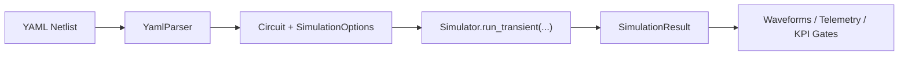

# Backend Architecture

PulsimCore is designed as a **Python-first simulation backend** with a high-performance C++ kernel and a stable YAML workflow for automation.

## Architectural Goals

- Deliver deterministic transient simulation for power electronics converters.
- Keep the user surface simple: `import pulsim` + YAML netlists.
- Isolate solver complexity behind typed options and telemetry.
- Support validation and parity workflows (ngspice/LTspice) from the same backend runtime.

## Runtime Layers

1. **Python API Layer (`python/pulsim`)**
   - Public package consumed by scripts, notebooks, and CI.
   - Exposes typed classes (`Circuit`, `Simulator`, `SimulationOptions`, `YamlParser`) and utility modules (`netlist`, `signal_evaluator`).
2. **Binding Layer (`python/bindings.cpp`)**
   - `pybind11` bridge between Python API and C++ kernel.
   - Preserves zero-copy/low-overhead behavior where possible.
3. **Core Kernel (`core/`)**
   - Unified `v1` execution path for fixed/variable timestep simulation.
   - Nonlinear solves, fallback policies, event handling, thermal coupling, and telemetry.
4. **Validation & Benchmarks (`benchmarks/`)**
   - Regression gate for runtime, accuracy, parity, and stress scenarios.

## Canonical Execution Flow

## Why This Design Works for Production

- **Stable user entrypoint**: product-facing surface stays in Python even while kernel internals evolve.
- **Performance isolation**: critical numerics remain in C++ while orchestration stays scriptable.
- **Observability built-in**: fallback trace, linear solver telemetry, and event diagnostics are first-class outputs.
- **Automation-ready**: benchmarks and parity scripts emit machine-readable artifacts (`*.json`, `*.csv`) for CI gates.

## Extension Boundaries

You can safely extend at the following boundaries:

- Add new YAML fields in parser with strict diagnostics.
- Add new virtual channels and telemetry fields in runtime outputs.
- Add new benchmark scenarios in `benchmarks/` and gate with `kpi_gate.py`.

Avoid changing the canonical `Simulator` execution contract unless accompanied by migration notes and compatibility tests.
