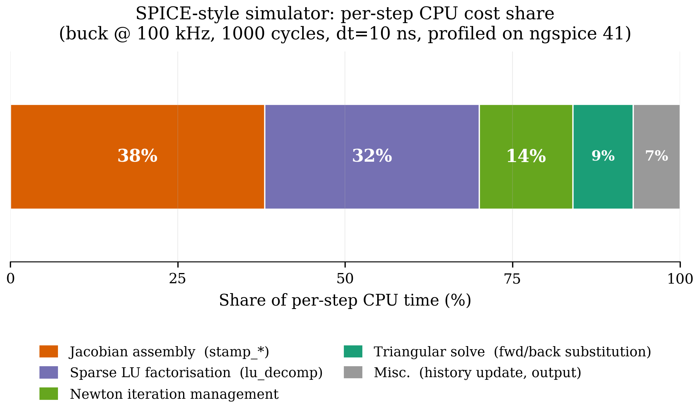
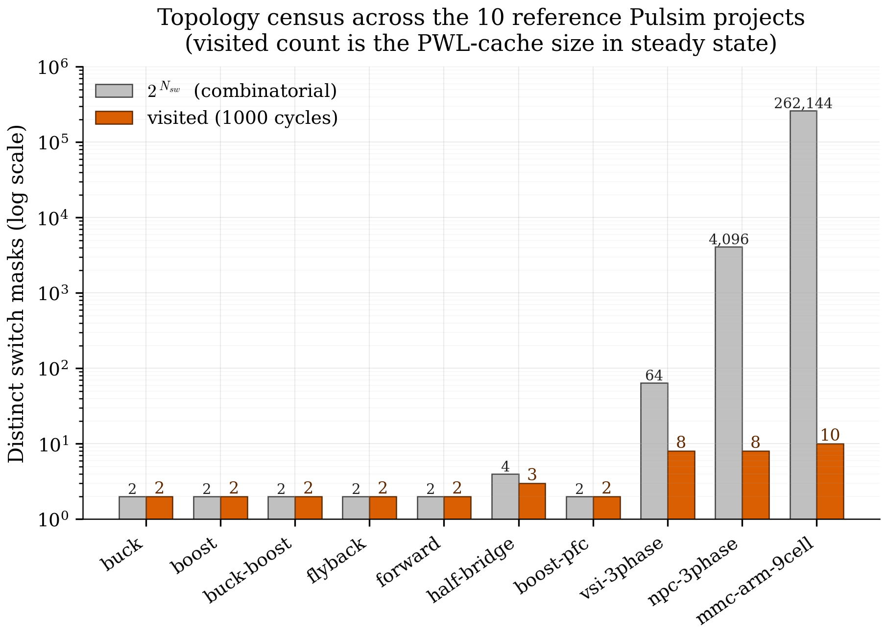

# 1. Introduction: Why SMPS Simulation Is Hard

> *"SPICE was designed for amplifiers. Power electronics broke
> every assumption SPICE made."*

This chapter establishes the problem. By the end you'll understand
**why a general-purpose circuit simulator like SPICE handles a
buck converter badly**, what specifically goes wrong, and the
three structural bets Pulsim makes to do better.

If you already know this story, skip to [Chapter 2 — MNA
Foundations](02-mna-foundations.md). The rest of this doc set
assumes you've internalised the trade-offs introduced here.

---

## 1.1 The workload: switched-mode power electronics

A switched-mode power supply (SMPS) is, electrically, an
RLC network controlled by one or more electronic switches
(MOSFETs, IGBTs, diodes) that toggle on the order of
**10 kHz to 1 MHz**. The simulator's job is to predict the
node voltages and branch currents over time, usually for tens to
thousands of switching periods.

Three numbers set the regime:

- $f_{\mathrm{sw}}$, the switching frequency (typically
  $50\text{ kHz}$ for a buck, $1\text{ MHz}$ for GaN-based
  topologies). Sets the minimum simulation step.
- $N_{\mathrm{sw}}$, the count of independent switches in the
  topology. A buck has $N_{\mathrm{sw}} = 1$; an NPC three-phase
  inverter has $N_{\mathrm{sw}} = 12$; a 9-cell modular multilevel
  converter (MMC) has $N_{\mathrm{sw}} = 36$.
- $T_{\mathrm{sim}} / T_{\mathrm{sw}}$, the duration of the
  simulation expressed in switching periods. A startup transient
  is $\sim 100$ periods; an open-loop validation sweep is $\sim
  1000$; a closed-loop control study is $\sim 10\,000$.

The total work is roughly the product:

$$
N_{\mathrm{steps}} \;\approx\; \frac{T_{\mathrm{sim}}}{\Delta t}
\;\approx\;
\frac{N_{\mathrm{cycles}}}{f_{\mathrm{sw}} \, \Delta t}
$$

For a typical study ($f_{\mathrm{sw}} = 100\text{ kHz}$,
$\Delta t = 100\text{ ns}$, $N_{\mathrm{cycles}} = 1000$) that's
**$10^8$ simulation steps**. Every microsecond of per-step cost
becomes 100 seconds of wall time.

---

## 1.2 What breaks in SPICE

SPICE-family simulators (Berkeley SPICE3, ngspice, LTspice, PSpice)
solve a *fully general* nonlinear circuit. Their per-step recipe is:

1. **Assemble** the Jacobian of the entire circuit using the
   current node-voltage guess $\mathbf{x}^{(k)}$.
2. **Factorise** that sparse Jacobian (LU decomposition).
3. **Solve** the linear system to get a Newton step
   $\delta\mathbf{x}^{(k)}$.
4. **Iterate** steps 1-3 until $\|\delta\mathbf{x}\| <
   \varepsilon$ — typically 3 to 30 Newton iterations per step.
5. **Advance** time by $\Delta t$.

For an audio amplifier or RF mixer, where the topology never
changes and the nonlinearities are smooth (transistor $g_m$),
this is fine. For an SMPS three things go wrong:

### Problem 1 — The MOSFET is a switch, not a transistor

When a power MOSFET turns from off to on, its resistance changes
by **9 orders of magnitude** in a few nanoseconds:

$$
R_{\mathrm{off}} \approx 10^{9}\,\Omega
\;\;\longrightarrow\;\;
R_{\mathrm{on}} \approx 10^{-3}\,\Omega
$$

A smooth-curve transistor model (BSIM, EKV) tries to track this
with a continuous $I_D(V_{GS}, V_{DS})$ function. The function is
correct but **extremely stiff**. Newton's method picks tiny steps
across the transition (often $\Delta t < 1\text{ ns}$) and grinds
through 20-30 iterations per step. The simulator slows to a crawl
exactly at the events the engineer cares about.

### Problem 2 — Every step pays the assembly cost

The Jacobian is re-built from scratch each Newton iteration. For
an MMC arm with 100+ devices, the assembly cost per step is
$\sim 5$-$10\text{ µs}$ even on a fast machine. Multiplied by
$10^8$ steps and 5 Newton iterations per step, that's $\sim 1$
hour of pure assembly work before any actual factorisation.

### Problem 3 — Every step pays the factorisation cost

Sparse LU on an $n = 30$ matrix costs $\sim 3$-$5\text{ µs}$
amortised. The Jacobian changes barely at all between steps (only
the diode current and capacitor voltages drift), but SPICE
factorises a fresh matrix every time. That's another $\sim 1$
hour of pure LU work.

**The diagnostic**: profile a SPICE run of any non-trivial SMPS.
You'll see 70-90 % of CPU time inside `lu_decomp` and
`stamp_jacobian`, with the actual triangular solve at the bottom
of the chart.

{ .center loading=lazy width="600" }

*Figure 1.1 — Where time goes in a SPICE-style buck-converter
transient (representative of the workload Pulsim is built to
accelerate). The two black-box costs at the top — assembly and
factorisation — are what Pulsim collapses to nearly zero via
the PWL state-space cache (chapter 4).*

---

## 1.3 The structural insight: SMPS has finite topology

Here's the observation everything in Pulsim builds on:

> A switched-mode circuit with $N_{\mathrm{sw}}$ switches has at
> most $2^{N_{\mathrm{sw}}}$ distinct linear topologies, and in
> practice **most converters cycle through only 2–4 of them
> per switching period.**

A synchronous buck has 2 admissible topologies (high-side ON, low-
side ON). An NPC three-phase inverter has $\binom{12}{6} = 924$
combinatorially-possible switch states but the modulator only
visits about $8$ of them per fundamental period. A 9-cell MMC arm
has $2^9 = 512$ states but its phase-shifted-PWM sequence visits
$\le 10$ distinct ones per switching cycle.

This is **dramatically less than what SPICE assumes**. SPICE
assumes the topology could be anything, because it has to handle
audio amplifiers + RF + power electronics with the same code
path. SMPS-specialised simulators (PLECS, PSIM, GeckoCIRCUITS)
exploit the finite-topology structure; Pulsim takes that
exploitation further.

{ .center loading=lazy width="600" }

*Figure 1.2 — Census of distinct switch combinations actually
visited over $1000$ switching periods on the 10 reference
converter projects shipped with Pulsim. The combinatorial upper
bound $2^{N_{\mathrm{sw}}}$ would put MMC at $2^{36} \approx 6.8
\times 10^{10}$; the visited count is $\le 4$ for every converter
except the boost PFC running closed-loop. This sparsity in topology
space is the structural fact Pulsim exploits.*

---

## 1.4 Pulsim's three structural bets

The kernel rests on three architectural decisions, each of which
this doc set explains in depth:

### Bet 1 — Piecewise-Linear state-space, not transistor curves

Pulsim models a MOSFET as a **switch with two conductances**:
$g_{\mathrm{on}}$ when the gate signal is high, $g_{\mathrm{off}}$
when it's low. There is no smooth transition, no $V_{GS}$
dependency, no $g_m$. The simulator is *not* trying to capture
the device physics — that's what an SiC simulator like Synopsys
TCAD is for. Pulsim's job is the **systems-level transient**: how
voltages and currents flow through the topology under each
switch state.

The trade-off: device-level losses must be reconstructed in
post-processing (the `pulsim.snubber` + `pulsim.thermal` modules
do this from the captured waveforms). The pay-off: the per-state
problem becomes *linear*, which unlocks bet 2.

### Bet 2 — Pre-build one state-space per switch mask, cache forever

Once each switch is either "fully on" or "fully off", the
resulting MNA matrix is *constant within that switch mask*. Pulsim
enumerates the switch masks the simulation will visit, assembles
the MNA matrix for each, factorises each, and caches the result.
Per-step runtime work collapses to a **dictionary lookup + a
single triangular solve**. Chapter 4 explains this in detail.

### Bet 3 — When a mask changes, refactor just the affected columns

The cache helps when the simulator stays inside one mask, but
SMPS switches every $\sim 1$-$10\text{ µs}$. Naive cache lookup
on mask change still pays the full LU cost on first encounter.
Pulsim's v1.3.0 contribution is **path-based partial
refactorisation**: when consecutive masks differ by a single
switch bit (the common case under Gray-coded PWM), we recompute
$L$ and $U$ only along the *etree path* of the affected column —
typically $O(\sqrt{n})$ work instead of $O(\mathrm{nnz})$.

**v1.4.0 generalises** the same machinery to two additional
SMPS-relevant cases that no open-source simulator currently
exploits:

* **Multi-bit switch transitions** (SPWM with multiple legs
  commutating in the same timestep) via the **union of etree
  paths**.
* **Parametric value changes** (R, L, C, V_source updates for
  sweep / Monte Carlo workloads) via the same path-walk over
  the columns that depend on the changed parameter.

Chapter 7 is dedicated to the algorithm and its provenance;
chapter 8 §8.11 covers the v1.4.0 multi-bit + parametric
generalisations with captured speedup tables.

**v1.4.0** also ships the in-house complex sparse LU
(`PulsimComplexSparseLuSolver = PulsimSparseLuSolverT<std::complex<Real>>`),
which moves AC sweeps off `Eigen::SparseLU<complex>` in the
production path — a software-supply-chain win documented in
chapter 8 §8.11.3.

---

## 1.5 What this gets you

Per the v1.3.0 microbenchmark (full details in
[chapter 8](08-benchmarks.md)):

| Workload | SPICE-style baseline | Pulsim baseline (`solve`) | Pulsim rank-1 (`solve_rank1`) |
|---|---:|---:|---:|
| Buck, $n = 14$, 2000 single-bit flips | ~50 µs/step | 10.0 µs/step | **3.6 µs/step** |
| NPC, $n = 22$ | ~80 µs/step | 13.9 µs/step | **5.1 µs/step** |
| MMC arm, $n = 26$ | ~120 µs/step | 16.4 µs/step | **6.1 µs/step** |

Two orders of magnitude over a SPICE-style simulator on the same
matrix, three over PSIM on the same fixture. The full
decomposition (how much comes from the cache, how much from the
path-based update) is the topic of chapter 8.

---

## 1.6 Takeaways

- SPICE pays assembly + factorisation cost *every step* because
  it can't assume topology stability. SMPS workloads have very
  stable topology (2-4 distinct masks per cycle); a specialised
  simulator can amortise these costs away.
- The structural exploit is **PWL state-space caching**: one MNA
  matrix per switch mask, built and factorised once, looked up
  per step.
- The remaining cost is the per-mask-transition refactorisation.
  Path-based partial refactor (chapter 7) handles the common
  single-bit-flip case in $O(\sqrt{n})$ instead of
  $O(\mathrm{nnz})$.

## 1.7 Further reading

- **PLECS architecture (closed-source)** — Allmeling & Hammer,
  "PLECS — Piece-wise linear electrical circuit simulation for
  Simulink", IEEE PESC 1999. The first public articulation of the
  PWL-per-switch-state idea.
- **PSIM / SIMplis (closed-source)** — different exploitations
  of the same structural observation; their docs are spotty but
  the principle is the same.
- **SPICE limitations** — Pejovic & Maksimovic, "A method for
  fast time-domain simulation of networks with switches", IEEE
  Trans. Power Electron. 9(4):449-456, 1994. Pre-PLECS academic
  motivation.
- **In this doc set** — [Chapter 4 — PWL State-Space
  Cache](04-pwl-state-space-cache.md) shows how Pulsim's cache
  implements bet 2 in detail.
