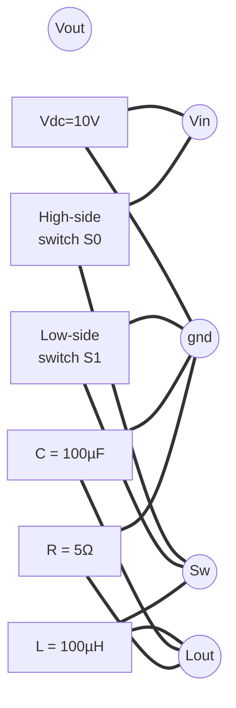
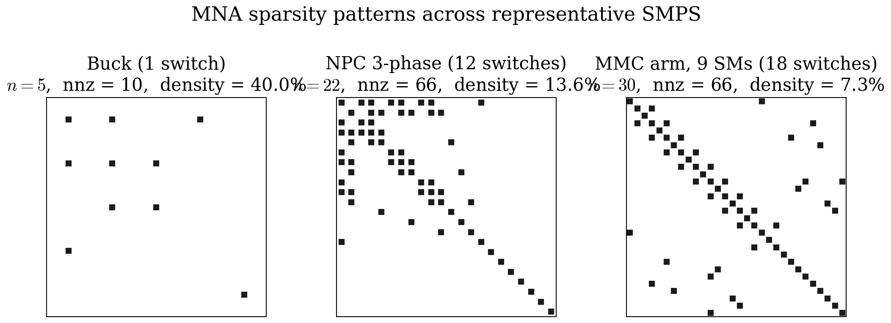

# 2. Modified Nodal Analysis (MNA) Foundations

A circuit is a network of nodes connected by branches. To
*simulate* a circuit, we need to turn that network into a system
of equations a computer can solve. This chapter walks the
mechanics of **Modified Nodal Analysis** (Ho, Ruehli & Brennan,
*IEEE Trans. Circuits & Systems* 22(6), 1975) — the formulation
Pulsim uses end-to-end.

By the end you'll know:

- What KCL stamps look like for resistors, capacitors, inductors,
  voltage sources, and switches
- Why voltage sources force the MNA matrix to be **augmented**
  (the "modified" in MNA)
- How a complete buck converter MNA system gets assembled
- What "sparse" actually means for SMPS matrices, and why it
  matters for the chapters that follow

---

## 2.1 KCL at a node, in matrix form

Kirchhoff's Current Law (KCL) says the sum of currents into any
node is zero. For a node $i$ connected to a set of branches
$\mathcal{B}_i$, that's:

$$
\sum_{b \in \mathcal{B}_i} I_b \;=\; 0
$$

For a purely resistive branch between nodes $a$ and $b$ with
conductance $G = 1/R$, Ohm's law gives
$I_{ab} = G\,(V_a - V_b)$. Writing KCL at node $a$:

$$
G\,(V_a - V_b) \;+\; \text{(other branch currents)} \;=\; 0
$$

Stack this for all nodes, with the unknowns being the node
voltages $\mathbf{V} = [V_1, V_2, \ldots, V_{N-1}]^T$ (ground
is fixed at $V_0 = 0$), and you get a matrix equation:

$$
G\,\mathbf{V} \;=\; \mathbf{I}_{\mathrm{inj}}
$$

where $G$ is the node conductance matrix and $\mathbf{I}_{\mathrm{inj}}$
collects the injected currents from independent sources. The
"stamping rule" for a resistor — the modification to $G$ when you
add a resistor between $a$ and $b$ — is:

$$
G_{aa} \mathrel{+}= G,\quad
G_{bb} \mathrel{+}= G,\quad
G_{ab} \mathrel{-}= G,\quad
G_{ba} \mathrel{-}= G
$$

This is the **resistor stamp**. Every circuit primitive has its
own stamp; the assembler walks all branches and accumulates them
into a single $G$ matrix.

---

## 2.2 What capacitors and inductors do

A capacitor satisfies $I_C = C\,\dot{V}_C$ and an inductor
satisfies $V_L = L\,\dot{I}_L$. These are *time-derivative*
relationships, so they belong on the left-hand side of the system
equations as **descriptor-form** dynamics:

$$
E\,\dot{\mathbf{x}} \;=\; A\,\mathbf{x} \;+\; B\,\mathbf{u}
$$

where:

- $\mathbf{x}$ is the state vector (node voltages + branch currents
  that need to be explicit)
- $E$ is the mass matrix (carries $C$ entries on capacitor-row
  diagonals, $-L$ entries on inductor-current rows)
- $A$ is the conductance matrix (the $G$ matrix from §2.1
  generalised to include source-augmentation rows)
- $B\mathbf{u}$ is the source vector

Chapter 3 explains how to discretise this descriptor form into
the per-step linear system the PWL cache stores. For now, the key
fact is: **both $E$ and $A$ are sparse, structured, and constant
within one switch mask**.

---

## 2.3 Voltage sources: why MNA gets "modified"

A pure voltage source has *zero* internal resistance — its
defining equation is $V_a - V_b = V_{\mathrm{src}}$, **not**
"current depends on voltage". You cannot stamp it into the
conductance matrix the way you would a resistor.

The fix is to introduce **one new unknown per voltage source**:
the source's branch current $I_{\mathrm{src}}$, treated as a state
in its own right. The source then contributes:

1. A KCL contribution at each terminal: current $I_{\mathrm{src}}$
   flows out of node $a$ into node $b$.
2. A **constraint row** that says $V_a - V_b = V_{\mathrm{src}}$
   (the source's defining equation).

The matrix grows by one row + one column per voltage source. The
stamp looks like:

```
        |    V_a    V_b   ...   I_src   |     RHS
--------+--------------------------------+----------
   KCL_a|     .      .    ...    +1     |      0
   KCL_b|     .      .    ...    -1     |      0
        |                                |
constr. |    +1     -1    ...     0     | V_src(t)
```

This **augmented** form — node-voltage rows plus per-source
branch-current rows — is the "Modified" in Modified Nodal
Analysis. Pulsim's `Index n_state = num_nodes + num_voltage_sources`
sizing convention (in `pwl/device_pool.hpp`) directly reflects
this rule.

---

## 2.4 A worked example: assembling a buck

The synchronous buck converter has 4 nodes plus ground and 1
voltage source:



*Figure 2.1 — Synchronous buck converter schematic. Two switches
(S0 = high-side, S1 = low-side) commute around the inductor;
ground is the reference node.*

The graph has **5 nodes** (counting ground) — `gnd, Vin, Sw,
Lout, Vout`. Wait — actually for this schematic there are 4
distinct non-ground nodes (`Vin, Sw, Lout, Vout`), but `Lout`
and `Vout` are the same node (the inductor's right terminal *is*
the output capacitor's top terminal). So we have:

- 4 non-ground nodes: `Vin = 1`, `Sw = 2`, `Vout = 3`,
  and one auxiliary node we'll need from the source augmentation.
- 1 voltage source → 1 augmentation row/col.

State size $n = 4 + 1 = 5$.

Initial conductance matrix $G$ (with switches `[S0=ON, S1=OFF]`,
the buck's "energising" phase):

$$
G \;=\;
\begin{bmatrix}
G_{S0}        & -G_{S0}                & 0          & +1 \\
-G_{S0}       & G_{S0} + G_{S1}        & 0          & 0  \\
0             & 0                      & G_R + G_C  & 0  \\
+1            & 0                      & 0          & 0
\end{bmatrix}
$$

with rows = `[Vin, Sw, Vout, Vsrc_constraint]` and columns the
same. $G_{S0} = 10^3$ (high-side switch, conducting),
$G_{S1} = 10^{-9}$ (low-side switch, blocking),
$G_R = 1/5 = 0.2$, $G_C = 0$ for now (capacitor's $G$ contribution
comes from discretisation — see chapter 3).

The state vector is:

$$
\mathbf{x} \;=\;
\begin{bmatrix}
V_{\mathrm{Vin}} \\
V_{\mathrm{Sw}} \\
V_{\mathrm{Vout}} \\
I_{V_{\mathrm{src}}}
\end{bmatrix}
$$

The mass matrix $E$ has zeros everywhere except the capacitor row:
$E_{\mathrm{Vout, Vout}} = C = 100\text{ µF}$, and the inductor
row (if we treated $I_L$ as an explicit state, which Pulsim
chooses not to for the buck — see chapter 4).

The right-hand side $\mathbf{b}$ has $V_{\mathrm{dc}} = 10$ V in
the constraint row. Putting it together:

$$
\underbrace{
\begin{bmatrix}
0 & 0 & 0     & 0 \\
0 & 0 & 0     & 0 \\
0 & 0 & C     & 0 \\
0 & 0 & 0     & 0
\end{bmatrix}
}_{E}
\;\dot{\mathbf{x}}
\;=\;
\underbrace{
\begin{bmatrix}
G_{S0}      & -G_{S0}             & 0          & +1 \\
-G_{S0}     & G_{S0}+G_{S1}       & 0          & 0  \\
0           & 0                   & G_R        & 0  \\
+1          & 0                   & 0          & 0
\end{bmatrix}
}_{A}
\mathbf{x}
\;+\;
\underbrace{
\begin{bmatrix}
0 \\ 0 \\ 0 \\ V_{\mathrm{dc}}
\end{bmatrix}
}_{B\mathbf{u}}
$$

That's a complete MNA system for the buck in its energising phase.
When the mask flips to `[S0=OFF, S1=ON]` the $G_{S0}$ and $G_{S1}$
values swap their roles in the matrix — **but the sparsity pattern
is identical**. This sparsity-pattern invariance under switch
toggling is the structural property that makes Chapter 7's
path-based partial refactor possible.

---

## 2.5 What "sparse" looks like for real SMPS

The buck above is only 4×4 — too small to show structure. A
representative production matrix is the NPC three-phase inverter
($n = 22$) or the MMC arm ($n = 30+$). Their sparsity patterns:

{ .center loading=lazy width="700" }

*Figure 2.2 — Sparsity patterns of representative SMPS MNA
matrices. Each black dot is a nonzero entry. The buck is dense
relative to its tiny size (10 nonzeros out of 16 = 62 %); NPC is
12 % dense; MMC is 7 % dense and falls roughly into a
**banded** structure that elimination-tree-based factorisations
exploit very efficiently (chapter 5).*

Three observations matter for what comes next:

1. **The diagonal is always populated.** Every node has at least
   a small self-conductance (otherwise the system is singular).
2. **Off-diagonal nonzeros are local.** A nonzero at $G_{ij}$
   means nodes $i$ and $j$ are *directly connected* by a branch.
   Real SMPS topologies are graphs where most node pairs are
   non-adjacent → most $G_{ij}$ are zero.
3. **Constraint rows from voltage sources are spike-like.** They
   add a row/column that's zero except at the terminal nodes +
   the $\pm 1$ pattern shown in §2.3 — extremely cheap to factor.

The MMC's bandedness is not accidental: it comes from the fact
that submodule $k$ is electrically adjacent only to submodules
$k-1$ and $k+1$ within the arm. RCM ordering (chapter 5) is the
algorithm that recovers this banded structure for any topology
where it exists naturally.

---

## 2.6 The general form Pulsim uses

For any switch mask $\mathbf{m}$, Pulsim assembles:

$$
E\,\dot{\mathbf{x}} \;=\;
A(\mathbf{m})\,\mathbf{x} \;+\; B\,\mathbf{u}(t)
$$

where:

- $E$ depends only on the **passive RLC components** — not on the
  switch mask. The mass matrix is shared across all $2^{N_{\mathrm{sw}}}$
  topologies.
- $A(\mathbf{m})$ depends on the switch mask through the
  $g_{\mathrm{on}} / g_{\mathrm{off}}$ stamps. The sparsity pattern is
  invariant under $\mathbf{m}$; only the conductance *values* change.
- $B\mathbf{u}(t)$ is the time-varying source vector. Source
  values move; their stamps are fixed.

This form is the input to chapter 3 (where we discretise it) and
chapter 4 (where we cache the discretised version per mask).

---

## 2.7 Where this lives in the codebase

| Concept | Header | Notes |
|---|---|---|
| Stamping primitives (resistor, capacitor, source, switch) | `core/include/pulsim/pwl/assemble.hpp` | One `stamp_*` function per device kind |
| State-vector sizing | `core/include/pulsim/pwl/device_pool.hpp` | `state_size(graph)` = `num_nodes + num_voltage_sources` |
| Per-mask matrix assembly | `core/include/pulsim/pwl/cache.hpp` | `PwlStateSpaceCache::build_lazy(dt)` calls the assembler for each mask |
| The MNA mass matrix construction | `core/include/pulsim/analysis/mna_sweep.hpp` `assemble_E_matrix()` | The reference for what goes into $E$ |

---

## 2.8 Takeaways

- MNA turns a circuit (nodes + branches) into a sparse linear
  system $A\mathbf{x} = \mathbf{b}$ via stamping rules — one
  rule per device kind.
- Voltage sources need **augmentation**: one extra row + column
  per source. State size grows accordingly.
- The MNA matrix is **sparse** (most node pairs are non-adjacent)
  and **structured** (the sparsity pattern is invariant under
  switch toggles — only the values change).
- Both invariances — sparsity and pattern-under-mask — are what
  Pulsim's chapters 4–7 exploit to skip work other simulators do.

## 2.9 Further reading

- **MNA, original paper**: Ho, Ruehli & Brennan, "The modified
  nodal approach to network analysis", *IEEE Trans. Circuits &
  Systems* 22(6):504-509, 1975. The definitive source.
- **Stamping rules for every device kind**: Vlach & Singhal,
  *Computer Methods for Circuit Analysis and Design*, Van Nostrand
  Reinhold, 1994 — chapters 4-6 walk through resistor, capacitor,
  inductor, controlled-source, transformer, op-amp stamps in
  reference detail.
- **Sparse-direct considerations for circuit MNA**: Davis,
  *Direct Methods for Sparse Linear Systems*, SIAM 2006 — chapter
  1 motivates why circuit simulation drove the development of
  sparse LU.
- **In this doc set** — [Chapter 5 — Sparse Direct LU
  Foundations](05-sparse-lu-foundations.md) explains how this
  sparsity is exploited to factor $A$ in $O(\mathrm{nnz} \cdot
  \log n)$ instead of $O(n^3)$.
