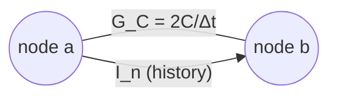
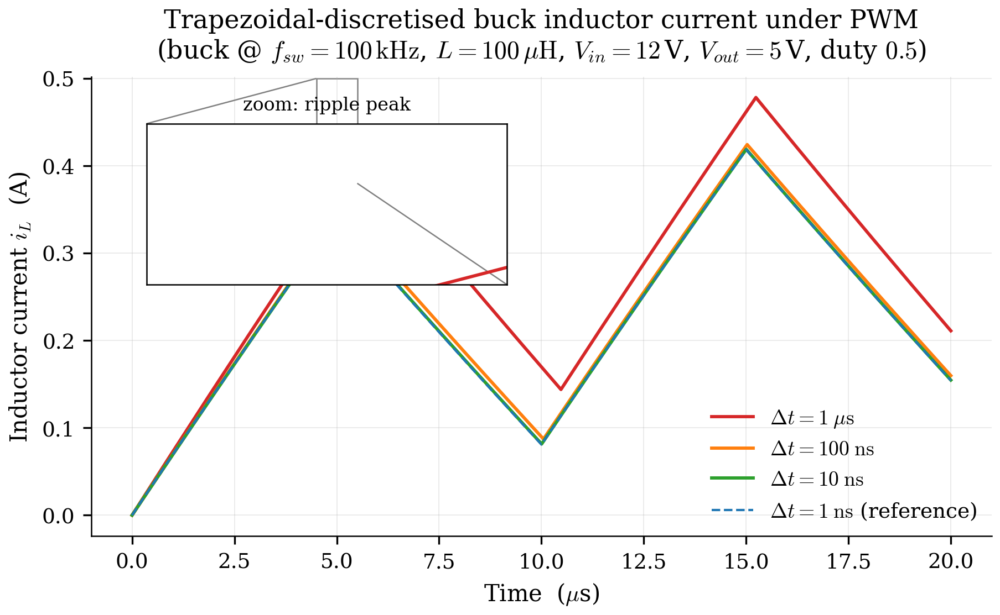

# 3. Trapezoidal Companion Discretisation

Chapter 2 ended with the continuous-time MNA system:

$$
E\,\dot{\mathbf{x}}(t) \;=\;
A(\mathbf{m})\,\mathbf{x}(t) \;+\; B\,\mathbf{u}(t)
$$

This chapter explains how Pulsim turns that ODE into a **linear
algebra problem solvable once per time step**. The technique is
classic: trapezoidal integration combined with the **companion-
model** view of reactive elements. By the end you'll know:

- Why trapezoidal (vs forward/backward Euler, RK4, BDF)
- The discrete form $\bigl(E - \tfrac{\Delta t}{2}A\bigr)
  \mathbf{x}_{n+1} = \bigl(E + \tfrac{\Delta t}{2}A\bigr)
  \mathbf{x}_n + \tfrac{\Delta t}{2}(B\mathbf{u}_n + B\mathbf{u}_{n+1})$
  and how Pulsim restructures it for cacheability
- How $\Delta t$ trades accuracy for runtime, and the practical
  guidance Pulsim's `simulate(...)` API gives

---

## 3.1 Why trapezoidal

There are dozens of ODE discretisation methods. Pulsim uses the
**trapezoidal rule** (also called Crank-Nicolson in PDEs, or the
average-of-Euler in some textbooks):

$$
\frac{\mathbf{x}_{n+1} - \mathbf{x}_n}{\Delta t}
\;\approx\;
\frac{1}{2}\bigl[\dot{\mathbf{x}}_n + \dot{\mathbf{x}}_{n+1}\bigr]
$$

In words: estimate the derivative at the *midpoint* of the
interval by averaging its endpoint values. Three properties make
this the textbook choice for SMPS simulation:

1. **Second-order accurate.** Local truncation error is
   $O(\Delta t^3)$ per step → global error $O(\Delta t^2)$.
   Forward/backward Euler are only first-order; RK4 is
   fourth-order but its 4 sub-stage assembly cost kills any
   benefit on a PWL system.
2. **A-stable.** Trapezoidal damps unbounded oscillations
   regardless of $\Delta t$ size, even for stiff systems. This
   matters because SMPS systems have time constants spanning
   $\sim 10\text{ ns}$ (switch transitions) to $\sim 100\text{ ms}$
   (output capacitor charging). Backward Euler is also A-stable
   but only first-order; explicit RK methods need
   $\Delta t < \tau_{\min}$ for stability.
3. **Symmetric.** Trapezoidal is time-reversible (within
   round-off). For LC tank ringing — extremely common in SMPS —
   trapezoidal preserves energy over many cycles. Backward Euler
   adds artificial damping that distorts ringdown waveforms; RK4
   adds even more.

The cost: trapezoidal is **implicit** — $\mathbf{x}_{n+1}$
appears on both sides of the update. We pay one linear solve per
step to handle that. The next sections show why that "cost" is
actually the whole point.

---

## 3.2 Substituting trapezoidal into MNA

Start from the continuous descriptor form:

$$
E\,\dot{\mathbf{x}}(t) \;=\;
A\,\mathbf{x}(t) \;+\; B\,\mathbf{u}(t)
$$

At the two endpoints of one step:

$$
E\,\dot{\mathbf{x}}_n \;=\; A\,\mathbf{x}_n + B\,\mathbf{u}_n
$$

$$
E\,\dot{\mathbf{x}}_{n+1} \;=\; A\,\mathbf{x}_{n+1} + B\,\mathbf{u}_{n+1}
$$

Average them to get $E$ times the average derivative:

$$
E \cdot \tfrac{1}{2}\bigl[\dot{\mathbf{x}}_n + \dot{\mathbf{x}}_{n+1}\bigr]
\;=\;
\tfrac{1}{2}\bigl[A\,\mathbf{x}_n + A\,\mathbf{x}_{n+1}\bigr]
+\tfrac{1}{2}\bigl[B\,\mathbf{u}_n + B\,\mathbf{u}_{n+1}\bigr]
$$

Replace the average derivative with the trapezoidal approximation
$(\mathbf{x}_{n+1} - \mathbf{x}_n) / \Delta t$:

$$
\frac{E}{\Delta t}\bigl[\mathbf{x}_{n+1} - \mathbf{x}_n\bigr]
\;=\;
\tfrac{1}{2}A\,\mathbf{x}_n + \tfrac{1}{2}A\,\mathbf{x}_{n+1}
+\tfrac{1}{2}\bigl[B\,\mathbf{u}_n + B\,\mathbf{u}_{n+1}\bigr]
$$

Multiply by $\Delta t$ and collect $\mathbf{x}_{n+1}$ on the left:

$$
\boxed{
\bigl[E - \tfrac{\Delta t}{2}A\bigr]\,\mathbf{x}_{n+1}
\;=\;
\bigl[E + \tfrac{\Delta t}{2}A\bigr]\,\mathbf{x}_n
+\tfrac{\Delta t}{2}\bigl[B\,\mathbf{u}_n + B\,\mathbf{u}_{n+1}\bigr]
}
$$

This is the **trapezoidal companion form** Pulsim uses
end-to-end. Let:

- $J \;=\; E - \tfrac{\Delta t}{2}A$ — the **companion matrix** on
  the left
- $K \;=\; E + \tfrac{\Delta t}{2}A$ — the **forward operator** on
  the right
- $\mathbf{b}_n \;=\; K\,\mathbf{x}_n + \tfrac{\Delta t}{2}(B\mathbf{u}_n + B\mathbf{u}_{n+1})$
  — the per-step right-hand side

Then each step is exactly **one linear solve**:

$$
J\,\mathbf{x}_{n+1} \;=\; \mathbf{b}_n
$$

The matrix $J$ depends on the switch mask $\mathbf{m}$ (because
$A$ does), but **not on time** within a mask. This is the
critical observation that unlocks Chapter 4's caching strategy.

---

## 3.3 The companion-model view

A different lens on the same algebra, useful when you want to
visualize what trapezoidal *does* to each reactive element:

For a capacitor with $i_C = C\,\dot{v}_C$, the trapezoidal
discretisation gives:

$$
i_{C,n+1} \;=\; \tfrac{2C}{\Delta t}\,v_{C,n+1}
\;-\; \tfrac{2C}{\Delta t}\,v_{C,n}
\;-\; i_{C,n}
$$

Read that as: at step $n+1$, the capacitor *looks like* a
conductance $G_C = 2C/\Delta t$ in parallel with a Norton current
source $I_{C,n} = G_C \cdot v_{C,n} + i_{C,n}$ representing its
history. Symbolically:

*Figure 3.1 — The companion model for a capacitor at step $n+1$
under trapezoidal integration. The capacitor is replaced by a
conductance $G_C = 2C/\Delta t$ in parallel with a history current
source $I_n$. Inductors get a dual model: a resistance
$R_L = 2L/\Delta t$ in series with a history voltage source.*

Once every reactive element is replaced by its companion, the
circuit is **purely resistive at this step**. You're solving
$G\,\mathbf{V} = \mathbf{I}_{\mathrm{inj}}$ exactly as in
chapter 2 — no derivatives in sight. The history currents/voltages
are constants you computed at the end of the previous step.

Pulsim does the matrix-level equivalent: it precomputes $J$ once
per mask, computes $\mathbf{b}_n$ each step, and runs one solve.
The companion-model view is helpful for intuition and for
debugging (every textbook SPICE walkthrough uses it), but the
matrix form is what actually executes.

---

## 3.4 What happens at a switch event

Mask changes happen *between* time steps in Pulsim: the simulator
samples $\mathbf{m}(t_n)$ at the start of each step and holds it
constant through the step. When the mask changes from step $n$ to
step $n+1$:

1. The matrix $J$ becomes $J(\mathbf{m}_{n+1})$ — different
   sparsity *values*, same sparsity *pattern* (chapter 2 §2.6).
2. The history term $K\,\mathbf{x}_n$ is computed using
   $K(\mathbf{m}_n)$ — the *old* mask's $K$. Continuity of $E$
   guarantees the state $\mathbf{x}_n$ is meaningful across the
   transition; only the elementwise derivative $\dot{\mathbf{x}}$
   discontinues.
3. Pulsim either (a) looks up the pre-built $J^{-1}_{(\mathbf{m}_{n+1})}$
   factor from the PWL cache (chapter 4) or (b) updates the
   existing factor in-place via path-based partial refactor
   (chapter 7).

The "either (a) or (b)" choice is what the v1.3.0 release made
fast. The cache amortises factorisation cost for masks visited
more than once; the partial refactor amortises it for single-bit-
flip transitions even on first encounter.

---

## 3.5 The $\Delta t$ knob — accuracy vs runtime

Global error is $O(\Delta t^2)$, so halving $\Delta t$ quarters
the error. Runtime is $O(1/\Delta t)$ (linear in step count), so
halving $\Delta t$ doubles the wall time. The trade-off:

$$
\mathrm{error} \cdot \mathrm{runtime}^{2} \;=\; \mathrm{const}
$$

In practice Pulsim's `pp.simulate(builder, t_end, dt)` lets you
pick $\Delta t$ directly. Guidance from the showcase notebooks:

| Workload | Recommended $\Delta t$ | Why |
|---|---|---|
| Buck @ $f_{\mathrm{sw}} = 100\text{ kHz}$ steady state | $100\text{ ns}$ | $\Delta t / T_{\mathrm{sw}} = 1\%$; captures inductor ripple cleanly |
| Same buck under PWM transitions | $20\text{ ns}$ | Catch switching edges within $\sim$ 1-2 steps |
| MMC @ $f_{\mathrm{sw}} = 10\text{ kHz}$ steady state | $1\text{ µs}$ | Larger $\Delta t$ ok because dynamics are slower per cycle |
| LDO loop study | $10\text{ ns}$ | Op-amp poles often $> 1\text{ MHz}$; smaller $\Delta t$ avoids aliasing the loop |

{ .center loading=lazy width="700" }

*Figure 3.2 — Buck-converter inductor current $i_L(t)$ over one
switching period at $\Delta t = 1\text{ µs}, 100\text{ ns},
10\text{ ns}, 1\text{ ns}$. The $1\text{ µs}$ trace misses the
ripple peak by $\sim 8\%$; the $100\text{ ns}$ trace is within
$0.1\%$ of the converged $1\text{ ns}$ reference. Pulsim's
default `simulate(...)` recommendation of $\Delta t = 100\text{ ns}$
for 100 kHz workloads is calibrated against this kind of
convergence study.*

---

## 3.6 Connection to the rest of the pipeline

The trapezoidal companion form $J\mathbf{x}_{n+1} = \mathbf{b}_n$
is what every downstream chapter operates on:

- **Chapter 4** caches $J$ per switch mask — assemble once,
  factorise once, look up forever.
- **Chapter 5** explains how to factorise a sparse $J$
  efficiently (RCM + Gilbert-Peierls).
- **Chapter 6** is Pulsim's in-house implementation of that
  factorisation (`PulsimSparseLuSolver`).
- **Chapter 7** is the algorithmic contribution: when the mask
  changes by one bit, update $J$'s LU factors along the etree
  path of the affected column instead of recomputing them.
- **Chapter 8** measures all of it.

The "linear solve per step" framing is what unifies the entire
doc set.

---

## 3.7 Where this lives in the codebase

| Concept | Header | Notes |
|---|---|---|
| Trapezoidal companion assembly | `core/include/pulsim/pwl/assemble.hpp` `assemble_segment(...)` | Builds $J$ and $\mathbf{b}_{\mathrm{constant}}$ given a mask and $\Delta t$ |
| Per-step `solve(mask, b_extra, x)` | `core/include/pulsim/pwl/cache.hpp` `PwlStateSpaceCache::solve(...)` | The hot loop's entry point |
| History term update | `core/src/run_transient.cpp` | Mostly handled implicitly by the cache: stores $E + (\Delta t/2) A$ pre-applied |
| The companion-model view of capacitors / inductors | `core/include/pulsim/pwl/dc_assemble.hpp` | Same stamps, $\Delta t = \infty$ for DC OP |

---

## 3.8 Takeaways

- The trapezoidal rule turns the continuous descriptor form
  $E\dot{\mathbf{x}} = A\mathbf{x} + B\mathbf{u}$ into the
  discrete linear system $J\mathbf{x}_{n+1} = \mathbf{b}_n$ with
  $J = E - \tfrac{\Delta t}{2}A$.
- Per-step work is exactly **one sparse linear solve**: assemble
  $\mathbf{b}_n$ (cheap, vector ops only) + solve $J\mathbf{x}_{n+1}
  = \mathbf{b}_n$ (the bulk of the cost).
- $J$ depends on the switch mask but **not on time within the
  mask**. Caching $J$'s LU factors per mask (chapter 4) is
  legitimate.
- $\Delta t$ trades quadratic accuracy for linear runtime;
  Pulsim's defaults are calibrated for 1% accuracy at typical
  SMPS switching frequencies.

## 3.9 Further reading

- **Trapezoidal in circuit simulation** — Pillage, Rohrer & Visweswariah,
  *Electronic Circuit and System Simulation Methods*, McGraw-Hill 1995,
  §6 covers the companion-model derivation in textbook detail.
- **A-stability and circuit stiffness** — Hairer & Wanner, *Solving
  Ordinary Differential Equations II: Stiff and Differential-
  Algebraic Problems*, Springer 1996. The reference for why
  trapezoidal vs BDF vs RK matters under stiffness.
- **In Pulsim** — `core/tests/layer4_v1/test_trapezoidal_companion.cpp`
  has the unit tests that verify the discretisation produces the
  expected analytic answers on RC and LC tanks.
- **In this doc set** — [Chapter 4 — PWL State-Space
  Cache](04-pwl-state-space-cache.md) is where $J$ becomes a
  cached, per-mask asset that the hot loop just looks up.
