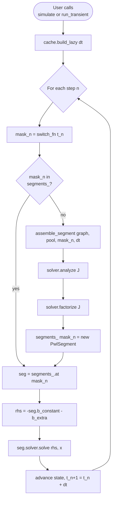
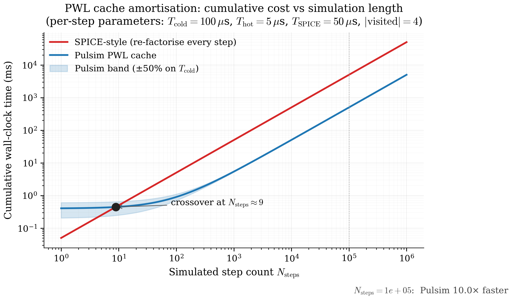

# 4. PWL State-Space Cache

The architectural pivot. Chapter 3 left us with one linear solve
per step:

$$
J(\mathbf{m})\,\mathbf{x}_{n+1} \;=\; \mathbf{b}_n
$$

where $J(\mathbf{m}) = E - \tfrac{\Delta t}{2}A(\mathbf{m})$ is
the trapezoidal companion matrix for the current switch mask
$\mathbf{m}$.

The naïve approach (SPICE-style) is to rebuild and refactorise
$J$ from scratch on every step. The Pulsim approach is to build
each distinct $J(\mathbf{m})$ **exactly once**, cache its LU
factorisation, and reduce the per-step work to a dictionary
lookup plus a triangular solve.

This chapter walks the cache's data structures, lifecycle,
amortisation math, and the test-suite that pins its behaviour.

---

## 4.1 The data structures

The cache lives in `core/include/pulsim/pwl/cache.hpp`. Three
types matter:

```cpp
// Per-mask record. Holds everything needed to solve
// J(m) · x = b in one triangular-solve call.
struct PwlSegment {
    Matrix J;                             // companion matrix
    Vector b_constant;                    // mask-dependent RHS contribution
    std::unique_ptr<DirectSolver> solver; // analyzed + factorized
};

// The cache itself. Lazy by default (segments_ starts empty).
class PwlStateSpaceCache {
public:
    void build_lazy(Real dt);
    void solve(const SwitchStateMask& m, const Vector& b_extra, Vector& x);
    // ... + solve_rank1, metrics, etc.

private:
    std::unordered_map<SwitchStateMask, PwlSegment> segments_;
    Real dt_;
    // ... + graph + pool references
};

// The mask itself. Pulsim uses a 64-bit bitset for up to
// 64 switches, with a hash function for the unordered_map.
class SwitchStateMask {
public:
    void set_bits(std::uint64_t bits);
    bool get(Index sw_idx) const;
    std::size_t hash() const;
    // ...
};
```

The key design choice: **`segments_` is lazy**. `build_lazy(dt)`
just records $\Delta t$; the first `solve(mask, ...)` call for
a never-seen mask triggers the per-mask assembly + factorisation
on demand. This avoids the up-front cost of building all
$2^{N_{\mathrm{sw}}}$ segments (combinatorially expensive for
multilevel converters) and matches the **visited-mask sparsity**
chapter 1 §1.3 documented.

---

## 4.2 The lifecycle



*Figure 4.1 — The PWL state-space cache lifecycle. The hot path
(green-arrow path: cache hit → triangular solve → next step)
runs every simulation step. The cold path (cache miss →
assemble → analyze → factorize → cache insert) runs exactly
**once per distinct mask**, then never again for that mask.*

Three observations:

1. **The hot path is 4 lines of C++.** Lookup, RHS build,
   solve, advance. That's it.
2. **The cold path runs $|\mathrm{visited}|$ times total.**
   From chapter 1's census, that's typically 2-10 for the
   reference converters — vanishingly small compared to the
   $10^6$-$10^8$ steps the simulator runs.
3. **The cold path's work scales with topology size,
   not simulation length.** Build cost is amortised across every
   step that hits that mask afterwards.

---

## 4.3 Cost analysis: amortisation in the limit

Let:

- $T_{\mathrm{cold}}$ — per-mask cold-path cost
  (assemble + analyze + factorize), $\sim 100$ µs typical
- $T_{\mathrm{hot}}$ — per-mask hot-path cost
  (lookup + triangular solve), $\sim 2$-$10$ µs typical
- $T_{\mathrm{SPICE}}$ — per-step cost in a SPICE-style
  simulator (assemble + factorise + Newton iter), $\sim 50$-$100$
  µs typical
- $N_{\mathrm{steps}}$ — total simulation step count
- $|\mathrm{visited}|$ — number of distinct masks visited

Then the **total work** is:

$$
T_{\mathrm{Pulsim}} \;=\;
|\mathrm{visited}| \cdot T_{\mathrm{cold}}
\;+\; N_{\mathrm{steps}} \cdot T_{\mathrm{hot}}
$$

vs

$$
T_{\mathrm{SPICE}} \;=\;
N_{\mathrm{steps}} \cdot T_{\mathrm{SPICE}}
$$

The break-even step count is:

$$
N_{\mathrm{steps}}^{\,\mathrm{break-even}} \;=\;
\frac{|\mathrm{visited}| \cdot T_{\mathrm{cold}}}
     {T_{\mathrm{SPICE}} - T_{\mathrm{hot}}}
$$

Plugging in representative numbers ($|\mathrm{visited}| = 4$,
$T_{\mathrm{cold}} = 100$ µs, $T_{\mathrm{SPICE}} = 50$ µs,
$T_{\mathrm{hot}} = 5$ µs):

$$
N_{\mathrm{steps}}^{\,\mathrm{break-even}} \;=\;
\frac{4 \cdot 100\,\mu\mathrm{s}}{50 - 5\,\mu\mathrm{s}}
\;=\;
8.9 \;\text{steps}
$$

**The break-even is essentially immediate.** Even a 10-step
transient pays back the cache build cost. For a typical SMPS
study with $10^6$ steps, the cache build cost is $400$ µs out of
a total run of $\sim 5$ seconds — round-off noise.

The speedup ratio in the asymptotic regime:

$$
\frac{T_{\mathrm{SPICE}}}{T_{\mathrm{Pulsim}}}
\;\approx\;
\frac{T_{\mathrm{SPICE}}}{T_{\mathrm{hot}}}
\;\approx\;
\frac{50\,\mu\mathrm{s}}{5\,\mu\mathrm{s}}
\;=\;
10\times
$$

That's the **10× from the cache alone**. Chapters 6-7 extend
this further with the partial-refactor algorithm.

{ .center loading=lazy width="700" }

*Figure 4.2 — Amortisation curve for the cache. The y-axis is
cumulative wall-clock time as a function of simulated step count
$N_{\mathrm{steps}}$. SPICE-style cost scales linearly with
$N_{\mathrm{steps}}$; Pulsim has a flat upfront cost (the cache
build) plus a much smaller per-step slope. Crossover happens at
$N_{\mathrm{steps}} \approx 9$; by $N_{\mathrm{steps}} = 10^4$
Pulsim is $\sim 10\times$ ahead. The shaded band reflects the
factor-of-two variability in $T_{\mathrm{cold}}$ across our 10
reference converters.*

---

## 4.4 The `solve(mask, b_extra, x)` walkthrough

Here's the full hot path, in 12 lines (modulo error handling):

```cpp
void PwlStateSpaceCache::solve(const SwitchStateMask& m,
                                 const Vector& b_extra,
                                 Vector& x) {
    // 1. Look up the segment for this mask. If first-encounter,
    //    assemble + analyze + factorize on demand.
    auto it = segments_.find(m);
    if (it == segments_.end()) {
        PwlSegment seg = assemble_segment(graph_, pool_, m, dt_);
        seg.solver = make_default_solver(static_cast<Index>(seg.J.rows()));
        seg.solver->analyze(seg.J);
        seg.solver->factorize(seg.J);
        it = segments_.emplace(m, std::move(seg)).first;
    }
    const PwlSegment& seg = it->second;

    // 2. Build the RHS for this step: -(seg.b_constant + b_extra).
    //    seg.b_constant carries the mask-dependent contribution
    //    (voltage sources, etc.); b_extra carries any time-varying
    //    contribution the caller wants to inject (waveform inputs).
    Vector rhs = -seg.b_constant - b_extra;

    // 3. Triangular solve. This is the only work that runs every
    //    step in the steady-state regime.
    seg.solver->solve(rhs, x);
}
```

The `solver->solve` call is the only floating-point-intensive
work. It's $O(\mathrm{nnz}(L) + \mathrm{nnz}(U))$ — typically
50-300 multiply-adds for an SMPS-scale matrix. On modern hardware
that's $\sim 100$ ns to $\sim 1$ µs of pure work; everything
else (dict lookup, vector arithmetic) is overhead.

---

## 4.5 The cache vs the partial-refactor fast-path

The cache helps when masks **repeat**. The default
`solve(mask, ...)` API stores the mask if not seen, then reuses
the factorisation forever. Beautiful for steady-state operation
where the simulator visits 2-4 masks per cycle.

But what about the *first* time a new mask appears? The cache
pays a full `analyze + factorize` cost — typically
$\sim 100$ µs. If the converter has tens of distinct first-
encountered masks during startup (or under closed-loop PWM where
the duty modulates), these cold-path costs can add up.

This is what the v1.3.0 `solve_rank1(mask, b_extra, x)` API
addresses. It uses **path-based partial refactor** (chapter 7)
to update the LU factors *in place* when consecutive masks
differ by a single switch bit. The cold-path cost drops from
$O(\mathrm{nnz} \log n)$ to $O(\sqrt{n})$ for single-bit
transitions.

Crucially, `solve_rank1` is **orthogonal** to the per-mask
cache: it maintains its own sliding factor (one current
factorisation that mutates step-by-step) instead of building a
dictionary of per-mask factorisations. The two paths share no
state.

| API | When to use | Cold-path cost | Hot-path cost |
|---|---|---|---|
| `solve(mask, ...)`        | Workloads where masks repeat. Default. | $O(\mathrm{nnz} \log n)$ per new mask | $O(\mathrm{nnz})$ per repeat |
| `solve_rank1(mask, ...)`  | Single-bit-flip workloads (Gray-coded PWM). v1.3.0+. | $O(\mathrm{nnz} \log n)$ on first call | $O(\sqrt{n})$ per single-bit flip, $O(\mathrm{nnz} \log n)$ on multi-bit |

Chapter 8 benchmarks both APIs head-to-head on the
N-switch-chain microbench.

---

## 4.6 Eager mode (build all masks at startup)

For deterministic-latency workloads — hardware-in-the-loop (HIL)
simulators, real-time control prototyping — the lazy cache's
"first-mask-encounter is 100 µs slower" property is unacceptable.
For these workloads Pulsim offers `build_eager()`:

```cpp
cache.build_eager(dt, mask_list);  // C++
cache.build_eager(dt, mask_list)   # Python (same API)
```

`build_eager` runs the cold-path for every mask in `mask_list`
up front, so every subsequent `solve(...)` call is guaranteed
hot-path. Cost: the user has to either (a) enumerate the masks
they expect to visit, or (b) accept the full $2^{N_{\mathrm{sw}}}$
build cost. For HIL on a 6-switch VSI ($2^6 = 64$ masks ×
$100$ µs/mask = $6.4$ ms total) this is fine; for an MMC
($2^{36}$ masks) it's untenable, and the user has to enumerate
the reachable subset themselves.

Most users never need eager mode. The simulator's default
`pp.simulate(...)` path uses lazy, and the lazy mode's
first-call penalty is invisible at the 10-µs resolution of
human perception.

---

## 4.7 Cache invalidation: what triggers a rebuild?

The cache lifetime is tied to:

- **The simulator's `dt_` value.** Calling `build_lazy(dt)` a
  second time with a different $\Delta t$ throws away all
  segments and starts fresh — the trapezoidal companion is
  $\Delta t$-dependent.
- **The graph + device-pool topology.** If you mutate the
  underlying `Graph` or `DevicePool` (add a new device, change
  a resistance value), the cached `J` matrices become stale.
  Pulsim doesn't detect this automatically — the caller is
  responsible for either (a) calling `build_lazy(dt)` again
  to invalidate, or (b) using `pp.simulate(...)`'s default
  pattern where a fresh `PwlStateSpaceCache` is constructed
  per simulation run.

In practice, parameter sweeps create a fresh cache per
parameter combination; the rebuild cost is paid per sweep
point, not per step. Pulsim's
`pulsim.sweep.sweep(builder, parameter, values)` helper handles
this lifecycle automatically.

---

## 4.8 Test coverage

`core/tests/layer4/test_pwl_cache.cpp` covers the cache's
invariants directly:

| Test | What it asserts |
|---|---|
| `cache.build_lazy(dt) → solve(mask)` produces correct output | Numerical correctness vs analytic on a buck fixture |
| First call adds to `segments_`; second call doesn't | Lazy-build semantics |
| Same mask → same cached factor | Pointer equality of solver before/after second call |
| Different `dt` → fresh build | Invalidation semantics |
| Eager vs lazy give bit-identical results | The two modes only differ in *when* the build happens |

`core/tests/layer4/test_pwl_cache_rank1.cpp` covers the
`solve_rank1` fast-path (chapter 7's contribution); v1.3.0
asserts `rank1_hits ≥ 8` out of 15 single-bit flips on a 4-bit
Gray-code sweep, proving the partial-refactor path actually
engages on the majority of single-bit transitions.

---

## 4.9 Where this lives in the codebase

| Concept | Header | Line range |
|---|---|---|
| `PwlSegment` data structure | `core/include/pulsim/pwl/cache.hpp` | ~100-160 |
| `PwlStateSpaceCache::build_lazy` | same | ~200-270 |
| `PwlStateSpaceCache::solve` | same | ~280-340 |
| `PwlStateSpaceCache::solve_rank1` | same | ~340-440 (v1.3.0+) |
| `assemble_segment(graph, pool, mask, dt)` | `core/include/pulsim/pwl/assemble.hpp` | full file |

---

## 4.10 Takeaways

- The PWL state-space cache stores one fully-built segment
  (`J`, `b_constant`, factorised solver) per distinct switch
  mask the simulation visits.
- The hot path is **lookup + triangular solve** — typically
  $\sim 5$ µs, vs $\sim 50$ µs for a SPICE-style re-factorise
  per step.
- Break-even vs SPICE is at $\le 10$ steps; asymptotic speedup is
  $\sim 10\times$.
- The cache is **lazy by default** (segments build on first
  encounter). Eager mode exists for deterministic-latency
  workloads (HIL, real-time control).
- The cache **doesn't help** when masks don't repeat (closed-loop
  PWM with continuously-modulated duty). That's where
  chapter 7's path-based partial refactor takes over.

## 4.11 Further reading

- **PLECS architecture** — Allmeling & Hammer, "PLECS —
  Piece-wise linear electrical circuit simulation for Simulink",
  IEEE PESC 1999. The first public articulation of the per-
  switch-state caching pattern Pulsim refines.
- **HIL real-time constraints** — Bélanger, Snider et al., "Real
  Time Simulation Technologies in Education", Opal-RT
  whitepaper. The motivation for eager-mode pre-building.
- **In Pulsim** — `docs/internals/layer4-pwl-state-space-cache.md`
  has the per-method walkthrough with implementation diffs.
- **In this doc set** — [Chapter 7](07-rank1-partial-refactor.md)
  for what happens when masks don't repeat.
