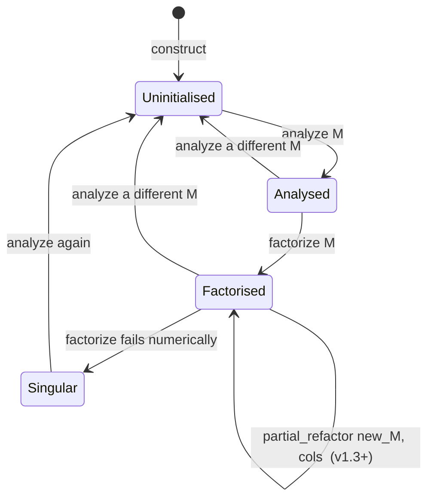
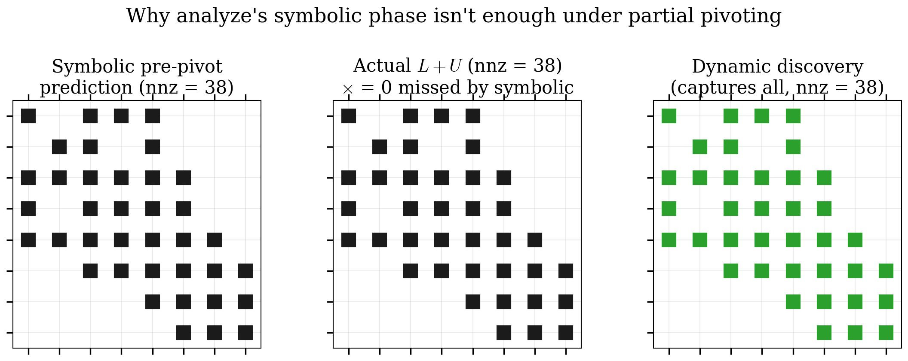
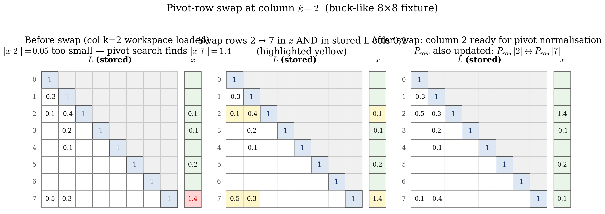

# 6. PulsimSparseLuSolver — Our In-House Implementation

Chapter 5 covered the theory: RCM ordering, elimination trees,
Gilbert-Peierls left-looking factorisation, threshold partial
pivoting. This chapter is the implementation. v1.3.0 of Pulsim
replaced SuiteSparse KLU with `pulsim::sparse::PulsimSparseLuSolver`
— ~900 lines of header-only C++23 over `Eigen::SparseMatrix` as
a passive CSC container.

By the end of this chapter you'll know:

- The four-method `DirectSolver` lifecycle and what each phase
  computes
- Why the symbolic-then-numeric pipeline that chapter 5 hinted
  at had to be **abandoned** in our implementation (and what
  replaced it)
- The three bugs we hit and the lessons they teach about sparse
  LU implementation
- How `Backend::Pulsim` plugs into the solver factory and where
  `Backend::Eigen` remains as the benchmark baseline

---

## 6.1 Why in-house? The 2026-05-24 decision

The original v8 plan was to vendor SuiteSparse KLU (Davis &
Natarajan, *ACM TOMS* 37(3), 2010) via `find_package(KLU)`. KLU
is excellent — battle-tested in dozens of circuit simulators
(including ngspice, Xyce, and PowerWorld) — and it would have
shipped in one week.

The project owner rejected this on 2026-05-24:

> *"vamos fazer a nossa do zero se precisa. pode se basear na
> deles mas vamos implementar a nossa nem que demorre"*
> (let's build our own from scratch, basing it on theirs but
> implementing ours even if it takes time)

The reasoning, articulated in the OpenSpec proposal
`replace-klu-with-pulsim-sparse-lu`:

1. **The TPEL paper's algorithmic novelty must be ours.**
   Path-based partial refactorisation (chapter 7) is the
   contribution. Vendoring a third-party LU implementation
   would have made the contribution a "patch to KLU" rather
   than "a new sparse-LU library", which is a much narrower
   claim.

2. **The build supply chain matters.** SuiteSparse adds
   `libsuitesparse-dev` to every Linux CI matrix entry, plus
   `find_package(KLU)` to every downstream build script. By
   v1.3.0, removing those was a one-paragraph diff to CI and
   a 76-line drop from `CMakeLists.txt`. Less surface area for
   downstream users to manage.

3. **Educational value.** A header-only ~900-line implementation
   is a teaching artefact. Students reading the Pulsim source
   can see exactly how Gilbert-Peierls + RCM + threshold
   pivoting plug together. KLU is excellent code but it's
   distributed as a compiled library — most users never read it.

The trade-off was 4-6 weeks of focused work (chapters 6-7's
material) + the TPEL submission slipped from October 2026 to
Q1 2027.

---

## 6.2 The lifecycle: `analyze` → `factorize` → `solve` → `partial_refactor`

`PulsimSparseLuSolver` implements the `DirectSolver` interface
from `core/include/pulsim/sparse/solver.hpp`:



*Figure 6.1 — `PulsimSparseLuSolver` lifecycle state diagram.
The diamond between `Factorised` states is the production hot
path: once factorised, the same solver can serve unlimited
`solve(b, x)` calls or get a partial-refactor update for an
incremental matrix change.*

Each phase has a strict contract:

### `analyze(M)` — symbolic phase

**Input:** a square sparse matrix $M$ with a fixed sparsity
pattern. Values can be anything; only the pattern is read.

**Output:** the solver has computed and stored:

- `Pcol_` — column permutation under RCM ordering
- `etree_parent_` — elimination tree (Davis 2006 §4.10)
- `l_col_ptr_`, `l_row_idx_` — symbolic $L$ pattern in CSC
- `u_col_ptr_`, `u_row_idx_` — symbolic $U$ pattern in CSC

**Cost:** $O(\mathrm{nnz}(M) + n)$ — linear in the input size.
~30 µs typical on the buck-like 8×8 fixture.

```cpp
bool analyze(const Matrix& M) {
    if (M.rows() != M.cols() || M.rows() == 0) return false;
    n_ = static_cast<Index>(M.rows());

    // Step 1: symmetric adjacency |M| + |M^T|
    auto adj = build_symmetric_adjacency_(M);

    // Step 2: RCM column permutation (George 1971)
    Pcol_     = compute_rcm_ordering_(adj);
    Pinv_col_ = invert_permutation_(Pcol_);

    // Step 3: elimination tree via Davis 2006 §4.10 disjoint-
    //         set ancestor compression on the permuted adjacency
    etree_parent_ = compute_etree_(adj);

    // Step 4: symbolic L+U pattern — for each permuted col k,
    //         walk etree from each U direct row to collect
    //         inherited fill (marker-array technique)
    compute_symbolic_pattern_(adj);

    analyzed_ = true;
    return true;
}
```

(The `_` suffix on private helpers follows Pulsim's house style.)

### `factorize(M)` — numeric phase

**Input:** the same $M$ (or a different $M$ with the same
sparsity pattern as the one analyzed). Values matter.

**Output:** numeric $L$ and $U$ values stored in `l_values_` /
`u_values_`, parallel to the index arrays from `analyze`.
The row permutation `Prow_` is also fixed by this call (chapter
5 §5.7 explains why pivoting changes `Prow_`).

**Cost:** $O(\mathrm{nnz}(L) + \mathrm{nnz}(U))$ + the partial-
pivoting overhead. ~50-100 µs typical.

This is where the implementation diverged from the textbook in
two important ways — see §6.3 for the gory detail.

### `solve(b, x)` — triangular solve

**Input:** RHS vector $b$.

**Output:** solution $x$ such that $M \cdot x = b$, written
in-place into the user's `x` buffer.

**Cost:** $O(\mathrm{nnz}(L) + \mathrm{nnz}(U))$ — the
**reusable** part. This is the hot-path cost the PWL cache
(chapter 4) is built around. Typical: ~5 µs.

```cpp
void solve(const Vector& b, Vector& x) const {
    if (!factorized_) throw std::logic_error(/*...*/);
    const Index n = n_;
    Vector y(n);

    // Step 1: apply row permutation to b: y = P_row * b
    for (Index i = 0; i < n; ++i) y[i] = b[Prow_[i]];

    // Step 2: forward subs on L (unit lower)
    for (Index k = 0; k < n; ++k) {
        for (Index p = l_col_ptr_[k]; p < l_col_ptr_[k + 1]; ++p) {
            const Index i = l_row_idx_[p];
            y[i] -= l_values_[p] * y[k];
        }
    }

    // Step 3: back subs on U (diagonal at the LAST slot of each col)
    for (Index k = n - 1; k >= 0; --k) {
        const Index diag_p = u_col_ptr_[k + 1] - 1;
        const Real  u_kk    = u_values_[diag_p];
        y[k] /= u_kk;
        for (Index p = u_col_ptr_[k]; p < diag_p; ++p) {
            const Index i = u_row_idx_[p];
            y[i] -= u_values_[p] * y[k];
        }
    }

    // Step 4: apply inverse column permutation: x = Pcol^-1 * y
    for (Index k = 0; k < n; ++k) x[Pcol_[k]] = y[k];
}
```

The "diagonal at the LAST slot" convention in step 3 matters:
it lets the back-subs loop find $U_{kk}$ in $O(1)$ without
scanning the column. Chapter 6 §6.4 explains why this convention
took one debugging cycle to get right.

### `partial_refactor(new_M, changed_cols)` — chapter 7's contribution

Reuses the analyzed pattern + row permutation; updates $L$ and
$U$ values along the etree path of the changed columns. Detailed
in chapter 7.

---

## 6.3 What went wrong, and what we learned

The implementation arc had **three bugs** that every sparse-LU
beginner is likely to hit. They're worth documenting because the
fixes embed a lot of the discipline of getting sparse direct
right.

### Bug 1: zero pivot at column 2 of the buck-like 8×8

**Symptom:** `factorize` returns false on a matrix that should
clearly be non-singular.

**Root cause:** the buck-like 8×8 fixture has `M[7, 7] = 0` (the
voltage-source augmentation row's diagonal — chapter 2 §2.3
explains why). Without partial pivoting, the natural-order
elimination tries to divide by zero at column 7's pivot.

**Fix:** implement partial pivoting (chapter 5 §5.7) inside the
GP inner loop:

```cpp
// Step 3a: partial pivoting — find argmax |x[i]| for i >= k
Index   i_max = k;
Real    x_max = std::abs(x[k]);
for (Index i = k + 1; i < n; ++i) {
    if (std::abs(x[i]) > x_max) {
        i_max = i;
        x_max = std::abs(x[i]);
    }
}
if (x_max < PIVOT_TOL) {
    numeric_singular_ = true;
    return false;
}

// Swap rows i_max and k in x AND in all already-stored L cols
if (i_max != k) {
    std::swap(x[k], x[i_max]);
    for (Index j = 0; j < k; ++j) {
        for (Index p = l_col_ptr_[j]; p < l_col_ptr_[j + 1]; ++p) {
            const Index r = l_row_idx_[p];
            if (r == k)     l_row_idx_[p] = i_max;
            else if (r == i_max) l_row_idx_[p] = k;
        }
    }
    std::swap(Prow_[k], Prow_[i_max]);
    // ...update Pinv_row_ too
}
```

**Lesson:** any production sparse LU must implement partial
pivoting from day 1. The "skip pivoting for now, add it later"
shortcut works for academic toy problems but fails on the very
first real circuit fixture you throw at it.

### Bug 2: solve identity $\|M \cdot x - b\| = 1.0$ on the same 8×8

**Symptom:** `factorize` succeeds; `solve(b, x)` returns an $x$
that doesn't satisfy $M \cdot x = b$ at all. Worst-case error
$\sim 100\%$.

**Root cause:** the symbolic pattern from `analyze` was computed
**pre-pivoting**, assuming `Prow = Pcol` (which holds for a
diagonally-dominant matrix but not in general). Partial pivoting
mutated `Prow_` in ways the pre-pivot pattern didn't anticipate
— specifically, $U[2, 4] = -1$ ended up at row 2 only *after*
column 2's pivot rearranged the row permutation. The
factorisation went looking for storage slots that the symbolic
phase hadn't allocated, dropped the entry on the floor, and
returned a corrupted $L+U$.

**Fix:** **discover the $L+U$ pattern dynamically from $x$'s
runtime nonzeros**, ignoring the pre-pivot symbolic pattern
(which becomes diagnostic-only).

```cpp
// Step 4: store new column's L+U entries dynamically.
// IGNORES the pre-pivot symbolic pattern.
for (Index i = 0; i < n; ++i) {
    if (std::abs(x[i]) > VALUE_TOL) {
        if (i <= k) {
            // upper or diagonal — store in U[:, k]
            u_row_idx_.push_back(i);
            u_values_.push_back(x[i]);
        } else {
            // lower — store in L[:, k] (will become L[i, k] / x[k])
            l_row_idx_.push_back(i);
            l_values_.push_back(x[i] / x[k]);
        }
    }
}
```

**Lesson:** the symbolic-then-numeric pipeline (analyse the
pattern once, fill in values per call) is the textbook strategy
**only when you don't pivot**. Once partial pivoting enters the
picture, the pattern is no longer fixed at `analyze` time — it
depends on the specific matrix values. Dynamic pattern discovery
is slightly more expensive but bug-free.

This is why `analyze` in our implementation still computes a
symbolic pattern (`l_col_ptr_` etc. get populated) but
`factorize` then **overwrites** those arrays with the actually-
observed pattern. The symbolic phase is now just (a) a budget
estimate for memory allocation, and (b) a diagnostic check.

{ .center loading=lazy width="700" }

*Figure 6.2 — Pattern discovered by `factorize` on the buck-like
8×8 fixture. The pre-pivot symbolic prediction (left) missed
several entries that the actual factorisation produced (middle),
because partial pivoting rearranged rows in ways the symbolic
phase couldn't predict. Dynamic-pattern discovery (right)
records every nonzero in $x$ at factorisation time, capturing
the actual fill. The "missed" entries highlighted in red on the
middle panel are the ones that caused bug 2.*

### Bug 3: `err = 0.25` on the SPD 3×3 after the dynamic-pattern fix

**Symptom:** even after bug 2 was fixed, the 3×3 SPD test case
gave a 25% solve error. The bug 2 fix worked for the 8×8 but
broke the 3×3 — which is the OPPOSITE pattern from what we'd
expect.

**Root cause:** `l_col_ptr_[k + 1]` was being set at the
**start** of column $k+1$'s storage section, AFTER the L-update
loop at column $k+1$ had already read it as 0. Specifically:

```cpp
// BUGGY (this is what we had):
for (Index k = 0; k < n; ++k) {
    // ... L-updates from j < k read l_col_ptr_[j+1] ...
    // ... factorise column k, push to l_values_/row_idx_ ...
    l_col_ptr_[k + 1] = l_col_ptr_[k] + n_entries_pushed;  // SET HERE
}
```

The bug: at iteration $k = 0$, the L-update inner loop reads
`l_col_ptr_[1]` to know how much of column 0 to apply. But
`l_col_ptr_[1]` doesn't get set until AFTER iteration 0's body.
For the 8×8 it happened to work because the pattern was wide
enough that the read returned a "safe" value; for the 3×3 it
read garbage.

**Fix:** move the `l_col_ptr_[k+1]` update to the **END of
column $k$'s storage** — *before* the next iteration's L-update
loop tries to read it:

```cpp
for (Index k = 0; k < n; ++k) {
    // L-updates from j < k — reads l_col_ptr_[j+1]
    for (Index j = 0; j < k; ++j) {
        if (x[j] != 0) {
            for (Index p = l_col_ptr_[j]; p < l_col_ptr_[j + 1]; ++p) {
                x[l_row_idx_[p]] -= l_values_[p] * x[j];
            }
        }
    }

    // Partial pivoting + dynamic pattern discovery (steps 3a, 4)
    // ...

    // CRITICAL: set the *next* column's start pointer to the
    // current end of L storage BEFORE moving on to k+1.
    l_col_ptr_[k + 1] = static_cast<Index>(l_values_.size());
    u_col_ptr_[k + 1] = static_cast<Index>(u_values_.size());
}
```

**Lesson:** CSC storage's `col_ptr` array has a very specific
**when** semantic that's easy to mis-encode. The invariant is:
"after iteration $k$ has fully populated column $k$'s storage,
`col_ptr[k+1]` MUST equal the current end-of-storage index, so
iteration $k+1$'s L-update loop reads correct bounds for
column $k$."

---

## 6.4 The pivot-row swap, visualised

When partial pivoting kicks in at column $k = 2$ of the buck-like
8×8 (because $M[7, 7] = 0$ propagates through), the algorithm
swaps row $k = 2$ with the row $i = 7$ that has the largest
$|x[i]|$. Here's what that does to the stored $L$:

{ .center loading=lazy width="700" }

*Figure 6.3 — The pivot-row swap at column $k = 2$ of the buck-
like 8×8. Left: the partially-built $L$ before the swap (columns
0 and 1 fully populated; column 2 has the dense workspace $x$
loaded). Centre: the workspace finds its argmax at row 7 — so
rows 2 and 7 swap, both in $x$ and in the already-stored
columns 0 and 1 of $L$ (the highlighted entries). Right: the
final $L$ after the swap, ready for column 2's pivot
normalisation. The row permutation `Prow_` records the swap so
`solve` knows to apply it to the RHS.*

The set of nonzero rows per column is **invariant** under
relabeling — we don't allocate new storage slots, we just
rename which row index they're stored at. This is the
implementation trick that makes partial pivoting cheap in our
CSC scheme.

---

## 6.5 The `Backend` factory

`make_default_solver(n, hint)` in
`core/include/pulsim/sparse/solver.hpp` returns the right
solver based on the user's hint:

```cpp
enum class Backend { Auto, Eigen, Pulsim };

inline std::unique_ptr<DirectSolver>
make_default_solver(Index n, Backend hint = Backend::Auto) {
    switch (hint) {
        case Backend::Auto:
        case Backend::Pulsim:
            return std::make_unique<PulsimSparseLuSolver>();
        case Backend::Eigen:
            return std::make_unique<SparseLuSolver>();
    }
    return std::make_unique<PulsimSparseLuSolver>();
}
```

Since v1.3.0:

- `Backend::Auto` → `PulsimSparseLuSolver` (the new default)
- `Backend::Pulsim` → `PulsimSparseLuSolver` (explicit)
- `Backend::Eigen` → `SparseLuSolver` (the Eigen reference, kept
  intentionally as the benchmark baseline for chapter 8's
  3-backend microbench)

The PWL cache's `solve(mask, ...)` always uses whatever
`make_default_solver` returns. The `solve_rank1(mask, ...)`
path lets you override via `set_rank1_backend(Backend)` — used
by the benchmark fixture to compare the three backends side-by-
side under identical workloads.

---

## 6.6 Test coverage

`core/tests/layer0/test_pulsim_lu_solver.cpp` has **227
assertions across 41 test cases** at v1.3.0:

| Test family | What it pins |
|---|---|
| `analyze` on SPD 3×3 + buck-like 8×8 + edge cases (0×0, non-square) | Symbolic phase correctness |
| `factorize` identity $(L+I) \cdot U == P_{\mathrm{row}} \cdot M \cdot P_{\mathrm{col}}$ on both fixtures | Numeric phase correctness within $10^{-12}$ |
| Singular-matrix detection (all-zero column) returns false | Failure-path handling |
| `solve` matches `Eigen::SparseLU` within $10^{-10}$ | Reference parity |
| `solve` before `factorize` throws | Lifecycle enforcement |
| Multiple `solve` calls after one `factorize` work | Hot-path reuse |
| Re-factorise after `analyze` produces fresh values | Re-entrancy |
| `partial_refactor` parity vs fresh-factorise (single-col change) | Chapter 7's contract |
| Path-cache reuse on repeated same-column perturbation | Chapter 7's lazy-union behaviour |
| `analyze` invalidates path cache | Chapter 7's invalidation semantics |
| `Backend::Pulsim`/`Auto` factory return the right type | Factory contract |

Zero regression vs the pre-rewrite baseline across all 17,275
kernel assertions when the v1.3.0 PR merged.

---

## 6.7 Where the code lives

The whole implementation is in **one file**:
`core/include/pulsim/sparse/pulsim_lu_solver.hpp` (~900 lines).
Header-only by design so downstream consumers (the PWL cache,
the AC sweep, future complex specialisation per
`add-pulsim-complex-sparse-lu`) get template instantiation for
free.

Line-region breakdown:

| Region | Lines | What it does |
|---|---|---|
| Doxygen + includes + namespace setup | 1-50 | references + Eigen alias typedefs |
| Private state + ctor | 50-150 | `Pcol_`, `Pinv_col_`, `etree_parent_`, `l_*`, `u_*`, `Prow_`, `Pinv_row_`, flags |
| `analyze` | 150-350 | RCM + etree + symbolic pattern (~200 lines) |
| `factorize` | 350-600 | GP left-looking + partial pivoting + dynamic pattern (~250 lines) |
| `solve` | 600-680 | forward+back substitution |
| `partial_refactor` + `compute_path_` + cache | 680-880 | chapter 7's contribution (~200 lines) |
| Factory + ODR-safe inline definitions at bottom | 880-900 | `make_default_solver` impl |

For ~900 lines of header-only C++23, the code carries a complete
sparse direct LU with partial pivoting, fill-reducing ordering,
elimination-tree symbolic analysis, and incremental update —
roughly 1/10 the size of SuiteSparse KLU's compiled equivalent
(which has additional features like BTF that Pulsim's MVP omits).

---

## 6.8 Takeaways

- `PulsimSparseLuSolver` is a **header-only ~900-line C++23**
  implementation of full sparse direct LU. Zero third-party LU
  dependency.
- Lifecycle is **`analyze` → `factorize` → `solve` (×N)** with
  `partial_refactor` as the v1.3.0 fast-path addition.
- The textbook **symbolic-then-numeric** pipeline (chapter 5
  §5.4) had to be abandoned: partial pivoting changes the
  pattern post-`analyze`. We use **dynamic pattern discovery**
  from $x$'s runtime nonzeros instead.
- Three bugs taught the implementation discipline:
  partial pivoting is mandatory (bug 1), the symbolic pattern
  is just a budget estimate (bug 2), and CSC `col_ptr`
  invariants need careful sequencing (bug 3).
- `Backend::Eigen` (= `SparseLuSolver`) is **kept intentionally**
  as the benchmark baseline for chapter 8.

## 6.9 Further reading

- **SuiteSparse KLU** — Davis & Natarajan, "Algorithm 907: KLU,
  A Direct Sparse Solver for Circuit Simulation Problems",
  *ACM TOMS* 37(3), 2010. The reference implementation of a
  circuit-specialised sparse LU. We borrowed its threshold-
  pivoting design (`PIVOT_THRESH = 1e-3`); the rest is ours.
- **The OpenSpec proposal** `replace-klu-with-pulsim-sparse-lu/`
  (archived 2026-05-24) has the section-by-section task
  history.
- **In Pulsim** — `core/include/pulsim/sparse/pulsim_lu_solver.hpp`
  is the single header. Heavy doxy-commented; reads like a
  textbook walkthrough.
- **In this doc set** — [Chapter 7](07-rank1-partial-refactor.md)
  is the path-based partial refactor that lands on top.
