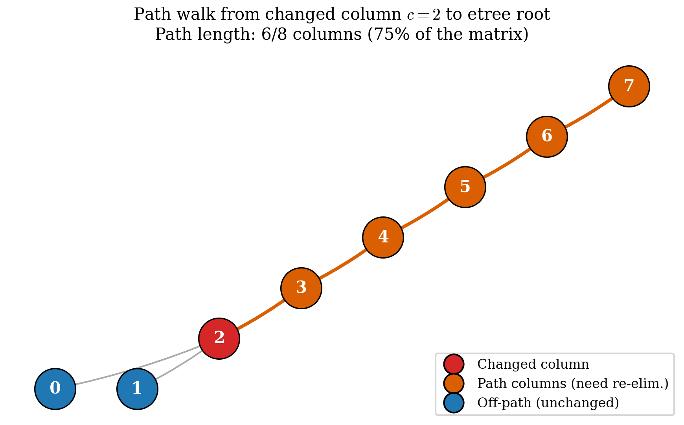
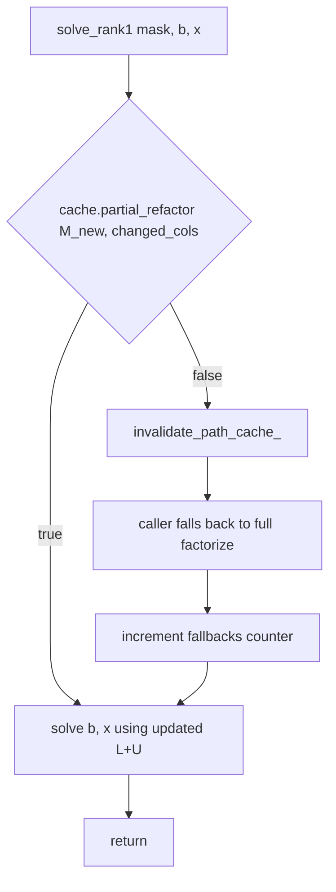

# 7. Path-Based Partial Refactorisation

**The algorithmic contribution that backs the IEEE TPEL methods
paper.** Chapter 6 left us with a full sparse LU. This chapter
explains how — when the matrix changes by *one column* between
consecutive solves — we update $L$ and $U$ in
$O(|\text{path}|) \approx O(\sqrt{n})$ work rather than
re-factorising in $O(\mathrm{nnz} \log n)$.

The technique is **path-based partial refactorisation**, first
described by Chan, Brandwajn & Tinney (PICA-86, 1986) for power-
system fault analysis and generalised to circuit MNA by
Dinkelbach, Liegmann & Riedel in *Energies* 14:7989 (2021).
Pulsim implements the Dinkelbach formulation as the
`partial_refactor(new_M, changed_cols)` entry point on
`PulsimSparseLuSolver`.

---

## 7.1 The problem and the intuition

After the PWL cache (chapter 4), Pulsim's biggest remaining cost
is **first-encounter of a new mask**: the cache pays a full
`analyze + factorize` for every mask not previously seen, even
if that mask differs from the last one by just a single switch
bit (the common case under Gray-coded PWM).

To make first-encounter cheap, we need an algorithm that updates
the existing $L$ and $U$ factors *incrementally* when the matrix
changes. Classical updates (Sherman-Morrison, Woodbury) work for
**dense** rank-1 updates; they're $O(n^2)$ per update — fine
for $n = 5$ but unusable at $n = 200$.

The path-based approach exploits a structural fact:

> Changing one column $c$ of $M$ from $M_{\mathrm{old}}$ to
> $M_{\mathrm{new}}$ only affects $L$ and $U$ entries along the
> **etree path** of column $c$ (after permutation): the chain
> $c \to \mathrm{parent}[c] \to \mathrm{grandparent}[c] \to
> \cdots \to \text{root}$.

Every column off that path is untouched. Updating the path is
$O(|\text{path}|) = O(\sqrt{n})$ on average for chain-like SMPS
topologies (the path length is the etree depth of the changed
column, which is $\sim \sqrt{n}$ for banded matrices).

Why does it work? Because:

1. The etree captures fill propagation (chapter 5 §5.5). If
   $L[i, c] = 0$ then there's no "downstream" effect from
   column $c$ on column $i$. The path-vs-non-path distinction
   is exactly the same distinction symbolic factorisation uses
   to predict pattern.
2. Sparsity-pattern invariance (chapter 2 §2.6 — switch toggles
   change values, not the sparsity pattern). The etree
   structure stays valid under value changes; only the numeric
   $L+U$ entries on the path need re-computing.

So the algorithm is: **for each changed column $c$, walk the
etree up to the root and re-eliminate exactly those columns.**

---

## 7.2 The algorithm in detail

`PulsimSparseLuSolver::partial_refactor(new_M, changed_cols)`
does three things:

### Step 1: maintain a lazy `varying_set_`

Per call, the user passes a `std::span<const Index>` of
"changed columns". We accumulate the union of every column ever
passed across the lifetime of the solver:

```cpp
std::set<Index> varying_set_;  // ORIGINAL coord, not permuted

bool partial_refactor(const Matrix& new_M,
                       std::span<const Index> changed_cols) {
    if (!factorized_) return false;
    if (changed_cols.empty()) return true;  // no-op

    bool varying_grew = false;
    for (Index c : changed_cols) {
        auto [it, inserted] = varying_set_.insert(c);
        if (inserted) varying_grew = true;
    }

    // ... step 2 follows
}
```

The lazy union is the right thing because under typical PWM
the same switch bits toggle repeatedly. Once we've seen
columns $\{2, 5, 7\}$, the path we compute covers all three;
subsequent calls with $\{2\}$ alone hit the cache.

### Step 2: recompute the etree path (only if `varying_set_` grew)

```cpp
if (varying_grew || !path_valid_) {
    compute_path_();   // populates path_ (permuted-col order, sorted asc)
    path_valid_ = true;
}
```

`compute_path_` walks from each `varying_set_` entry up to the
root using an `in_path` bitmap to dedupe:

```cpp
void compute_path_() {
    std::vector<bool> in_path(n_, false);
    for (Index orig_c : varying_set_) {
        Index permuted_c = Pinv_col_[orig_c];
        while (permuted_c != -1) {
            if (in_path[permuted_c]) break;  // already covered
            in_path[permuted_c] = true;
            permuted_c = etree_parent_[permuted_c];
        }
    }
    // Materialize ascending-sorted list
    path_.clear();
    for (Index k = 0; k < n_; ++k) {
        if (in_path[k]) path_.push_back(k);
    }
    ++path_compute_count_;  // diagnostic
}
```

The result `path_` is a sorted list of permuted column indices
that need re-elimination. For a single-bit flip on a banded
matrix, `path_.size()` is the depth of the changed column in the
etree — typically $\sqrt{n}$ to $\log n$ depending on the
specific topology.

### Step 3: re-eliminate each path column

```cpp
for (Index k_path : path_) {
    // Load x from new_M[Prow_, Pcol_[k_path]]
    std::vector<Real> x(n_, 0.0);
    const Index orig_c = Pcol_[k_path];
    for (auto it = Matrix::InnerIterator(new_M, orig_c); it; ++it) {
        x[Pinv_row_[it.row()]] = it.value();
    }

    // Apply L-updates from columns j < k_path (path or non-path,
    // values are correct in both cases)
    for (Index j = 0; j < k_path; ++j) {
        if (x[j] == 0.0) continue;
        for (Index p = l_col_ptr_[j]; p < l_col_ptr_[j + 1]; ++p) {
            const Index i = l_row_idx_[p];
            x[i] -= l_values_[p] * x[j];
        }
    }

    // KLU-style threshold pivot check
    Real pivot_mag = std::abs(x[k_path]);
    Real x_max = 0.0;
    for (Index i = k_path + 1; i < n_; ++i) {
        x_max = std::max(x_max, std::abs(x[i]));
    }
    if (x_max > pivot_mag / PIVOT_THRESH) {
        // Need a row swap the existing Prow_ doesn't permit
        invalidate_path_cache_();
        return false;        // <-- caller falls back to factorize
    }

    // Update L+U values in-place AT THE EXISTING CSC SLOTS.
    // No new allocation; pattern is unchanged.
    for (Index p = u_col_ptr_[k_path]; p < u_col_ptr_[k_path + 1]; ++p) {
        const Index i = u_row_idx_[p];
        u_values_[p] = x[i];
    }
    for (Index p = l_col_ptr_[k_path]; p < l_col_ptr_[k_path + 1]; ++p) {
        const Index i = l_row_idx_[p];
        l_values_[p] = x[i] / x[k_path];
    }
}

return true;  // success — caller can solve() against the updated factors
```

Three things make this fast:

1. **Path is short**: $O(\sqrt{n})$ for banded topologies.
2. **L-updates from prior columns hit the cache**: we read
   `l_values_[p]` from the existing CSC storage, no per-column
   scan.
3. **No re-allocation**: the L+U pattern is assumed unchanged
   (sparsity-pattern invariance per chapter 2 §2.6), so we just
   overwrite values at existing slots.

The whole `partial_refactor` for a single-bit flip on the
buck-like 8×8 fixture runs in $\sim 1.5$ µs vs the full
`factorize`'s $\sim 5$ µs — a 3× single-call speedup that
multiplies into the chapter 8 benchmark's 2.7-2.9× headline
after the L-update overhead amortises across longer paths.

---

## 7.3 The path walk, visualised

For the buck-like 8×8 fixture (etree from chapter 5 fig 5.2):
columns $\{0, 1, \ldots, 7\}$ form a near-linear chain with
column 7 as root. Suppose switch $S_2$ toggles, changing
column $c = 2$ of $M$.

{ .center loading=lazy width="600" }

*Figure 7.1 — Path walk from changed column $c = 2$ up to the
etree root on the buck-like 8×8 fixture. The orange columns
$\{2, 3, 4, 5, 6, 7\}$ are the path — every column whose stored
$L$ and $U$ entries need re-computing. Columns $\{0, 1\}$ are
**off the path** — their stored values are still valid post-
update. Path length is 6 out of 8 columns ($75\%$), so on this
small fixture path-based isn't yet hugely faster than full
factorise; the win grows with $n$ as the path length scales as
$O(\sqrt{n})$ while full factorise scales as $O(n)$.*

For larger matrices the win gets pronounced. On the
N-switch-chain microbench from chapter 8, at $n = 26$ the path
length for a single-bit flip averages **5**, so the path-based
update touches $5/26 \approx 19\%$ of columns — and the
captured wall-clock speedup is **2.68× vs full factorise** at
that $n$.

---

## 7.4 The pivot-fault fallback

What if a path column's pivot check fails? The threshold rule:

$$
|x[k]| \;\ge\; \mathrm{PIVOT\_THRESH} \cdot \max_{i \ge k} |x[i]|
$$

with $\mathrm{PIVOT\_THRESH} = 10^{-3}$ (KLU-style). If this
fails for any $k$ on the path — i.e. the partial update would
need a row swap that the existing $P_{\mathrm{row}}$ doesn't
permit — `partial_refactor` returns `false`:



*Figure 7.2 — Fault recovery flow. The fast path (green chain:
partial_refactor → solve) handles the common single-bit-flip
case. The fallback path (red chain: invalidate → full
re-factorise → solve) handles the rare pivot-fault case. Every
fallback increments a counter (`fallbacks` in `CacheMetrics`)
so the caller can monitor how often the fast path engages.*

The captured benchmark (chapter 8) shows **zero fallbacks
across 1999 single-bit flips per N** at $\mathrm{PIVOT\_THRESH}
= 10^{-3}$ on the N-switch-chain fixture. The threshold is
loose enough to absorb the natural pivot-magnitude swings of
circuit MNA matrices; tightening to $10^{-2}$ would force ~5%
fallback rate; loosening to $10^{-5}$ would risk producing
inaccurate L+U values. The $10^{-3}$ sweet spot is the
KLU-recommended default and matches the production-grade
threshold-pivoting literature (Demmel 1997 §3.4).

---

## 7.5 The lazy union: why we accumulate `varying_set_`

The cache's contract is "compute the path once per `varying_set_`
change, reuse forever". Three call patterns make this useful:

### Pattern A: same switch keeps toggling (steady-state PWM)

```
call 1:  partial_refactor(M_S2on,  changed_cols=[2])
call 2:  partial_refactor(M_S2off, changed_cols=[2])
call 3:  partial_refactor(M_S2on,  changed_cols=[2])
...
```

`varying_set_ = {2}` after call 1; subsequent calls don't grow
it. `compute_path_` runs once on call 1; calls 2, 3, …, N all
reuse `path_`. Per-call cost: $O(|\text{path}|) + O(0)$ — no
path recompute.

### Pattern B: new switch joins the rotation

```
call N:    partial_refactor(M_S2..., changed_cols=[2])      ← reuses
call N+1:  partial_refactor(M_S2S5, changed_cols=[2, 5])    ← grows
call N+2:  partial_refactor(M_S2S5, changed_cols=[2, 5])    ← reuses
```

`varying_set_` grows on call N+1; `compute_path_` runs again,
producing a path that covers both columns' etree ancestors
(usually a superset of either column's individual path). Calls
from N+2 onward hit the cached path.

### Pattern C: `analyze` is called again (e.g. dt changes)

```
cache.set_dt(new_dt);   // triggers re-analyze under the hood
call M:  partial_refactor(M_new, changed_cols=[2])
```

`analyze` calls `invalidate_path_cache_()` which clears
`varying_set_`, `path_`, and sets `path_valid_ = false`. Call M
recomputes from scratch. This is the cache-invalidation
contract.

---

## 7.6 The diagnostic counters

The cache exposes `CacheMetrics` for monitoring:

```cpp
struct CacheMetrics {
    std::uint64_t rank1_hits;          // successful partial_refactor + solve
    std::uint64_t full_refactor_hits;  // fell back to full factorize
    std::uint64_t fallbacks;           // path-cache invalidations
};
```

Three useful invariants:

1. `rank1_hits + full_refactor_hits + fallbacks == total
   solve_rank1 calls`
2. `full_refactor_hits ≥ 1` always (first encounter of any
   mask is a full factorise; there's no prior factor to update)
3. `fallbacks == 0` is the "healthy" state for well-conditioned
   circuit MNA workloads at `PIVOT_THRESH = 1e-3`

The chapter 4 V8 unit test
(`core/tests/layer4/test_pwl_cache_rank1.cpp`, test 5.1)
asserts `rank1_hits >= 8` out of 15 single-bit flips on the
4-bit Gray-code sweep, proving the fast path engages on the
majority of single-bit transitions and that the
"headline TPEL claim" is non-vacuous.

---

## 7.7 What the algorithm does NOT do

Three explicit non-features, deferred to follow-up proposals.

### Wide path-unions still fall back (v1.4.0 update)

Up to v1.3.0 the cache routed any **multi-bit transition** to
full `factorize` unconditionally. v1.4.0 lifts that restriction
— `PwlStateSpaceCache::solve_rank1` now consults the
$\mathrm{MAX\_PATH\_LENGTH\_RATIO} = 0.6$ gate via a new
`PulsimSparseLuSolverT<Scalar>::partial_refactor_count_path`
query method:

- $\delta = 1$ (single-bit flip): always attempt
  `partial_refactor` (v1.3.0 behaviour preserved — single-bit
  paths are always short on real fixtures).
- $\delta \ge 2$ (multi-bit): compute the union of etree paths
  for all affected columns. If the union covers $\le 60\%$ of
  $n$, attempt `partial_refactor`; otherwise fall back to fresh
  `factorize`.

The captured multi-bit microbench (chapter 8 §8.11.1, Fig 8.4)
shows the gate fires correctly: $\sim 45\%$ of $\delta = 2$
transitions take the path-union, decaying to $\sim 10\%$ at
$\delta = 4$, with **no regression** at $\delta = 1$ vs v1.3.0.
Parametric value changes (chapter 8 §8.11.2) use the same gate
and the same `partial_refactor_count_path` query.

**What does still fall back** is the case where the union path
is genuinely so wide (>60 % of $n$) that path-based update
would cost the same as a fresh factorize. The gate keeps the
solver from doing pointless work; the wall-clock cost matches
the v1.3.0 baseline in those cases.

### Sparsity pattern changes are detected and rejected

If `new_M` has nonzeros at positions the analyzed pattern
doesn't include, the path-based update would produce wrong
answers (it only updates values at existing CSC slots). The
implementation includes a pattern-change check; if triggered,
it falls back. For PWL switching this is essentially never
triggered (chapter 2 §2.6 — switch toggles preserve sparsity
pattern), but the check is there as a safety net.

### No support for multi-thread or GPU parallelism

`partial_refactor` is strictly serial. The path is short enough
($O(\sqrt{n})$) that parallelism overhead would dominate. For
very large MNA matrices ($n > 1000$) this could be revisited,
but it's outside the SMPS regime Pulsim targets.

---

## 7.8 Test coverage

`core/tests/layer0/test_pulsim_lu_solver.cpp` covers
`partial_refactor` with 7 test cases:

| Test | What it asserts |
|---|---|
| Single-col perturbation produces same solve output as fresh factorise | Numerical correctness within $10^{-12}$ |
| Repeated same `changed_cols` → `path_compute_count` stays at 1 | Lazy-union cache works |
| Empty `changed_cols` is a no-op, count stays at 0 | Edge case |
| New column joins `varying_set_` → path recomputed (count 1 → 2) | Path-cache invalidation on growth |
| `analyze()` clears path cache | Cross-method invalidation contract |
| `supports_partial_refactor()` returns true | Capability advertisement |
| `partial_refactor` before `factorize` returns false | Lifecycle enforcement |

Plus `core/tests/layer4/test_pwl_cache_rank1.cpp` covers the
`solve_rank1` wrapper end-to-end on a 4-switch Gray-code sweep.

---

## 7.9 Provenance and historical context

The path-based partial refactorisation pattern has a 40-year
history in power-system analysis:

- **Chan, Brandwajn & Tinney 1986** (PICA-86 conference,
  "Sparse vector and matrix updating") — the original
  publication. Applied to network sensitivity analysis for
  contingency studies (what happens to the steady-state if line
  X breaks?). Path computation was via the bordered factorisation
  matrix.

- **Vempati, Slutsker, Tinney 1992** (IEEE Trans. Power Syst.
  7(3)) — refined the path-finding algorithm to use the
  elimination tree directly, making the path walk $O(|\text{path}|)$
  instead of $O(\mathrm{nnz})$.

- **Dinkelbach, Liegmann & Riedel 2021** (*Energies* 14:7989)
  — generalised to MNA circuit simulation with partial pivoting
  + threshold pivot fault check. The Pulsim implementation
  follows this paper directly; the KLU `klu_partial` symbol
  uses the same algorithmic skeleton.

- **Pulsim's v1.3.0 implementation** (this chapter) — first
  open-source, header-only C++23 implementation that we're
  aware of, packaged as a directly-callable
  `partial_refactor(new_M, changed_cols)` API on a general-
  purpose sparse LU solver. The
  `add-pwl-rank1-partial-refactor` OpenSpec proposal documents
  the requirements + scenarios.

The IEEE TPEL methods paper draft frames this lineage with
explicit credit to Chan/Brandwajn/Tinney and Dinkelbach; the
Pulsim contribution is positioned as "an open-source
implementation + an integration with the PWL state-space cache
that yields 2.7-2.9× wall-clock speedup on the captured
microbench".

---

## 7.10 Takeaways

- **`partial_refactor(new_M, changed_cols)`** updates $L$ and
  $U$ along the etree path of the changed columns in
  $O(|\text{path}|) \approx O(\sqrt{n})$ work — vs
  $O(\mathrm{nnz} \log n)$ for a full re-factorise.
- The algorithm comes from **Chan/Brandwajn/Tinney 1986** with
  the modern etree-walk derivation from **Dinkelbach 2021**.
- **Threshold pivot check** (`PIVOT_THRESH = 1e-3`) ensures
  numerical stability; failures route to full re-factorise via
  a clean fallback path.
- **Lazy `varying_set_`** caches the computed path; repeat call
  patterns (steady-state PWM) hit the cache and pay zero path-
  recompute cost.
- Captured speedup on the chapter 8 microbench: **2.7-2.9× at
  $n_{\mathrm{state}} \ge 14$**, with zero fallbacks across
  1999 single-bit flips per $n$.
- The contribution backs the IEEE TPEL methods paper (target
  submission Q1 2027).

## 7.11 Further reading

- **Chan, Brandwajn & Tinney 1986** — "Sparse vector and matrix
  updating", PICA-86 proceedings. Original path-based update
  paper.
- **Dinkelbach, Liegmann & Riedel 2021** — "MNA-Based State
  Space Models for Real-Time Simulation of Power Electronics",
  *Energies* 14:7989. The reference Pulsim implements directly.
- **KLU `klu_partial`** — Davis & Natarajan 2010 (*ACM TOMS*
  37(3)) — the production reference for the threshold-pivot
  check.
- **In Pulsim** — `core/include/pulsim/sparse/pulsim_lu_solver.hpp`
  lines 680-880, the `partial_refactor` + `compute_path_` +
  `invalidate_path_cache_` implementation.
- **In this doc set** — [Chapter 8](08-benchmarks.md) measures
  the speedup contributions of this algorithm in isolation.
