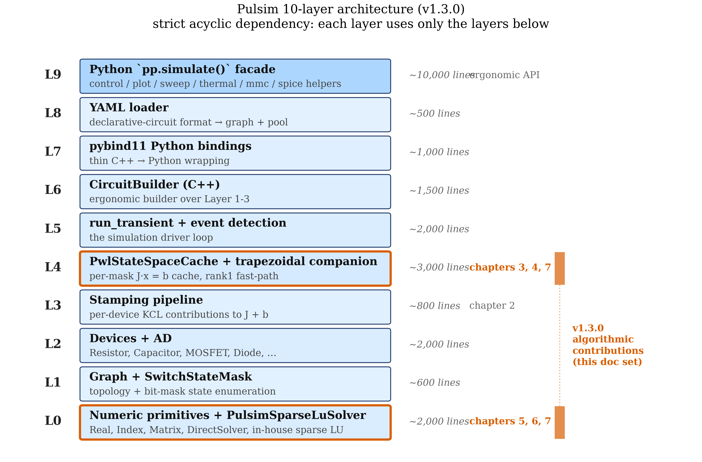
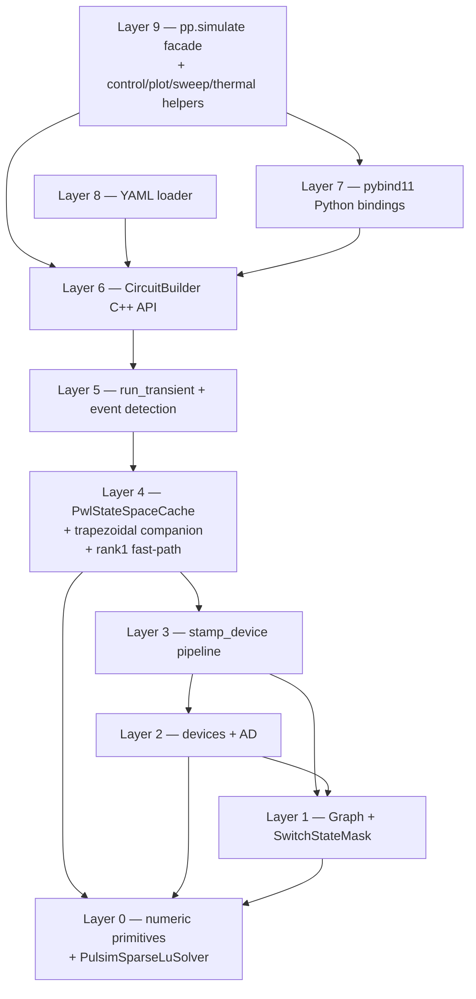

# 9. Architecture Walkthrough

The previous eight chapters covered the **algorithms**. This
chapter covers the **codebase**: the 10-layer architecture that
organises ~30,000 lines of C++23 + Python so that each
algorithm fits cleanly into its own slot. By the end you'll
know where to start reading, what each layer is responsible
for, and where to add a new device, a new ODE discretisation,
or a new sparse-LU optimisation.

---

## 9.1 The layer model

Pulsim's kernel is organised as 10 strictly acyclic layers.
Each layer depends on all layers below; no layer depends on
any layer above. This is the same discipline that makes the
Linux kernel + LLVM scaleable: a clean dependency DAG lets
each layer be **tested in isolation** without spinning up the
layers above.

{ .center loading=lazy width="700" }

*Figure 9.1 — The 10 layers of the Pulsim kernel, from the
numeric primitives at the bottom to the Python `pp.simulate(...)`
ergonomic facade at the top. Each box is shaded by its line-
count contribution (relative size); arrows show the algorithm
each layer hosts (from chapters 2-7). The "v1.3.0 algorithmic
contributions" highlighted on the right are the topics of this
doc set.*

The dependency rule is enforced by **per-layer CMake targets**
and **separate test binaries** (`pulsim_core_layer{0..9}_tests`).
If `Layer 4`'s tests link successfully without `Layer 5+`, the
layer separation is provably enforced; conversely, if a `Layer 2`
test fails to compile after editing `Layer 3`, that's a
direction-of-dependency leak that fails CI.

---

## 9.2 Layer-by-layer summary

### Layer 0 — Numeric primitives

**Responsibilities:** `Real` (double), `Index` (int64),
`Vector` (Eigen dense), `Matrix` (Eigen sparse, CSC). The
`DirectSolver` abstract interface (`analyze` / `factorize` /
`solve` / `partial_refactor`). The `SparseLuSolver` (Eigen
reference, `Backend::Eigen`) and **`PulsimSparseLuSolver`**
(in-house, default since v1.3.0). Number-type aliases used by
every other layer.

**Hosts:** Chapters 5-7's algorithms. ~1,500 lines.

**Headers:** `core/include/pulsim/numeric/`,
`core/include/pulsim/sparse/`.

**Tests:** `core/tests/layer0/` — **227 assertions across 41
test cases** at v1.3.0 (the in-house sparse LU coverage).

### Layer 1 — Topology + switch enumeration

**Responsibilities:** `Graph` (nodes + branches),
`BranchKind` enum (Passive, Source, Switch, ...),
`SwitchStateMask` (64-bit bitset of switch positions). The
graph operations that turn an abstract circuit into something
the assemblers can stamp.

**Headers:** `core/include/pulsim/topology/`.

**Tests:** `core/tests/layer1/`.

### Layer 2 — Device models + automatic differentiation

**Responsibilities:** the device library —
`Resistor`, `Capacitor`, `Inductor`, `VoltageSource`,
`IdealDiode`, `MosfetLevel1`, `IgbtLevel1`, `Transformer`, etc.
Each device exposes `evaluate_current_and_jacobian(state)`
returning $i$ and $\partial i / \partial v$ via forward-mode
automatic differentiation.

**Headers:** `core/include/pulsim/pwl/devices/`,
`core/include/pulsim/ad/`.

**Tests:** `core/tests/layer2/`,
`core/tests/layer2_v1/` (MOSFET/IGBT specialised),
`core/tests/layer2_v2/` (transformer).

### Layer 3 — Stamping pipeline

**Responsibilities:** `stamp_device<DeviceKind>(graph, pool,
mask, J, b)` — for each device kind, contribute its KCL
stamps + RHS contribution to the global $J$ and $\mathbf{b}$.
Chapter 2 §2.4 walked the buck example; the stamp functions
are what assemble those entries.

**Headers:** `core/include/pulsim/pwl/assemble.hpp`,
`core/include/pulsim/pwl/dc_assemble.hpp`.

**Tests:** `core/tests/layer3/`.

### Layer 4 — PWL state-space cache + trapezoidal companion

**Responsibilities:** the architectural pivot.
`PwlStateSpaceCache` (chapter 4), trapezoidal companion
discretisation (chapter 3), DC operating-point solver,
Newton-refinement on nonlinear devices, the
**`solve_rank1(...)` v1.3.0 fast-path** (chapter 7's algorithm
plugged in here).

**Headers:** `core/include/pulsim/pwl/cache.hpp`,
`core/include/pulsim/pwl/dc_op.hpp`.

**Tests:**
- `core/tests/layer4/` — cache + rank1 fast-path (the v1.3.0
  PR landed 5 new tests here for the partial-refactor path)
- `core/tests/layer4_v1/` through `layer4_v10/` — historical
  feature additions, each one a deliverable from a prior
  OpenSpec proposal (DC OP, Newton globalization, LM-Newton,
  lazy cache, multi-dt cache, warm-start, etc.)

### Layer 5 — Solver + event detection + `run_transient`

**Responsibilities:** the main simulation driver.
`run_transient(cache, graph, pool, opts, switch_fn,
b_extra_fn, step_observer)` — the loop that calls
`cache.solve(mask, b_extra, x)` per step, detects switching
events (zero-crossings, threshold crossings), and triggers
`SimulationResult` accumulation.

**Headers:** `core/include/pulsim/runtime/run_transient.hpp`.

**Tests:**
- `core/tests/layer5/` — driver semantics
- `core/tests/layer5_v1/` — buck validation (14,604 assertions
  spanning all 10 reference projects)
- `core/tests/layer5_v2/`-`v4/` — event detection + ideal
  diode + Newton-in-run-transient

### Layer 6 — `CircuitBuilder` (C++ user API)

**Responsibilities:** the user-facing API for constructing
circuits programmatically. `builder.add_resistor("R1", "n0",
"n1", 100.0)`, `builder.add_voltage_source(...)`, etc. Wraps
the lower layers in an ergonomic interface.

**Headers:** `core/include/pulsim/builder/`.

**Tests:** `core/tests/layer6/`.

### Layer 7 — Python bindings (pybind11)

**Responsibilities:** Python `pulsim._pulsim` module — the
pybind11 wrapping of every public C++ class.
`pulsim.CircuitBuilder`, `pulsim.PwlStateSpaceCache`,
`pulsim.run_transient`, `pulsim.SwitchStateMask`, etc.
Includes the `IdealDiodeParams` Python wrappers for device
parameter structs.

**Source:** `python/src/` — under 1,000 lines of pybind11
glue. Pulsim's bindings deliberately stay thin; richer Python
API lives in Layer 9.

**Tests:** `python/tests/` — pytest, runs in the CI matrix on
Python 3.10/3.11/3.12/3.13 × ubuntu/macos/windows.

### Layer 8 — YAML loader

**Responsibilities:** `pp.load_yaml_file(path)` — load a
circuit from a declarative YAML schema. The YAML parses to a
`LoadedCircuit` containing the graph + pool, ready for
`PwlStateSpaceCache` to consume.

**Headers:** `core/include/pulsim/yaml/loader.hpp`.

**Tests:** `core/tests/layer8/`.

### Layer 9 — Python `simulate()` ergonomic facade

**Responsibilities:** `pulsim.simulate(builder, t_end, dt, ...)`
— the one-call API documented in the `python/pulsim/__init__.py`
docstring. Auto-detects nonlinear devices, sets sensible
defaults for `enable_nonlinear_refresh` / `switch_fn` / progress
reporting, and wraps the lower-layer `run_transient` call.

Also under this layer: every Python helper module —
`pulsim.control`, `pulsim.plot`, `pulsim.scope`,
`pulsim.sweep`, `pulsim.thermal`, `pulsim.mmc`, etc. ~10,000+
lines of pure-Python value-add on top of the C++ kernel.

**Source:** `python/pulsim/`.

**Tests:** `python/tests/` — same matrix as Layer 7.

---

## 9.3 Cross-layer dependency graph



*Figure 9.2 — The strict acyclic dependency graph. Arrows
point from "depends on" to "depended on". Layer 0 (numeric
primitives + sparse LU) is the foundation everyone uses; Layer
9 (Python facade) is reached only via Layer 7 (bindings) + Layer
6 (builder). The Python interpreter never sees the inner layers
directly — every Python call enters through `CircuitBuilder`,
`SwitchStateMask`, or `PwlStateSpaceCache`, all of which live
at Layer 6 or below.*

The graph is **strictly acyclic** — no back-edges. This is
checked by the CMake target structure (each layer's
`target_link_libraries` only references the layers below it)
and would fail at link time if a back-edge were introduced.

---

## 9.4 The "where do I add X?" cheat sheet

A new contributor's most common question:

| What you want to add | Layer(s) | Example pattern |
|---|---|---|
| **New device kind** (e.g. JFET, GaN HEMT) | 2 + 3 | New `pulsim/pwl/devices/jfet.hpp` evaluator + `stamp_jfet(...)` in `assemble.hpp`. Add to `DeviceVariant` in Layer 2; add a switch case in `assemble_segment` |
| **New ODE discretisation** (e.g. BDF2, Gear's method) | 4 | Add `assemble_segment_bdf2(...)` parallel to the trapezoidal companion. The PWL cache becomes parametric on the discretisation. |
| **New event-detection algorithm** (e.g. polynomial fit) | 5 | New `detect_event_polynomial(...)` in `run_transient`'s event-detection module |
| **New sparse-LU algorithm** (e.g. BTF, COLAMD ordering) | 0 | Add to `PulsimSparseLuSolver` (extend `compute_*_ordering_` / add a BTF prepass) |
| **New backend** (e.g. CUDA cuSPARSE) | 0 | Implement `DirectSolver` interface in a new class; add to `Backend` enum + factory |
| **New top-level Python helper** | 9 | Add a new `pulsim/foo.py`; re-export from `pulsim/__init__.py` |
| **New circuit topology (reference project)** | n/a | Add to `projects/foo/` with a `foo_model.py` + `foo_pulsim_validation.py` + 3 generated notebooks |

The recurring pattern: **changes that need new C++ types go
into a new sub-namespace under `core/include/pulsim/`; changes
that are pure orchestration go into the Python layer**. Pulsim's
philosophy is "C++ for the math, Python for the ergonomics".

---

## 9.5 Test-suite mapping

Each layer has its own test binary. The full v1.3.0 inventory:

| Layer | Binary | Assertions | Notes |
|---|---|---:|---|
| 0 | `pulsim_core_layer0_tests` | 227 | v1.3.0 added 60+ for the in-house sparse LU |
| 1 | `pulsim_core_layer1_tests` | TBD | |
| 2 | `pulsim_core_layer2_tests` + `_v1` + `_v2` | TBD | MOSFET/IGBT + transformer |
| 3 | `pulsim_core_layer3_tests` | TBD | stamping |
| 4 | `pulsim_core_layer4_tests` + `_v1` … `_v10` | 172 + … | PWL cache + 10 successor versions |
| 5 | `pulsim_core_layer5_tests` + `_v1` … `_v4` | 2,069 + 14,604 + 101 + … | the bulk of behaviour coverage |
| 6 | `pulsim_core_builder_tests` | TBD | |
| 7 | (Python) | varies | runs in CI matrix |
| 8 | `pulsim_core_yaml_tests` | TBD | |
| 9 | `python/tests/test_*.py` | 200+ | high-level integration |

**Total at v1.3.0: 17,275 assertions** across the C++ kernel
plus 200+ Python integration tests. Zero regression vs the
pre-v1.3.0 baseline when the v1.3.0 PR merged.

The **test-coverage rule** is enforced by code review:

> *Any new feature lands with its layer's test binary updated
> in the same PR; PRs that touch C++ without touching tests
> don't merge.*

This is what's allowed the layer separation to stay clean
across 100+ feature additions — every layer has a "this still
works" assertion bank that the next feature must not regress.

---

## 9.6 The build system

`CMakeLists.txt` at the root composes everything:

```cmake
# Root CMakeLists.txt (paraphrased)
find_package(Eigen3 3.4 REQUIRED)

FetchContent_Declare(yaml-cpp ...)
FetchContent_MakeAvailable(yaml-cpp)

# Header-only interface library — Layer 0..6 + 8 all live here
add_library(pulsim_core INTERFACE)
target_link_libraries(pulsim_core INTERFACE
    Eigen3::Eigen
    yaml-cpp::yaml-cpp)
target_compile_features(pulsim_core INTERFACE cxx_std_23)
add_library(pulsim::core ALIAS pulsim_core)

# Per-layer test binaries
add_subdirectory(core/tests/layer0)
add_subdirectory(core/tests/layer1)
# ... etc

# Python bindings (Layer 7)
add_subdirectory(python)
```

Two consequences:

1. **`pulsim_core` is header-only.** No `.so` to link against;
   downstream consumers just `find_package(pulsim)` and include
   the headers. This makes Pulsim trivial to vendor into other
   projects.
2. **Test binaries are independent.** Each layer's test binary
   compiles + runs separately. You can `cmake --build build
   --target pulsim_core_layer0_tests` to get just the sparse-LU
   tests without compiling the full simulator.

The full build (kernel + Python bindings + all tests) takes
~5 minutes on macOS / Apple Silicon with Ninja + AppleClang 17.
Incremental rebuilds after editing a single header are
~10 seconds.

---

## 9.7 The release cadence

Pulsim releases follow semantic versioning:

- **Major** (1.x → 2.x): breaking public API change to the
  Python facade (Layer 9). Hasn't happened post-1.0.
- **Minor** (1.2 → 1.3): new feature, possibly with breaking
  changes to the C++ kernel-builder API (Layer 6) or removed
  deprecated APIs. v1.3.0 was the in-house sparse LU release.
- **Patch** (1.3.0 → 1.3.1): bug fix, no API change.

Each minor release has:

- An OpenSpec proposal under `openspec/changes/<name>/`
  (eventually archived to `openspec/changes/archive/`)
- A `CHANGELOG.md` entry under the new version heading
- Version bumps in `pyproject.toml`,
  `python/pulsim/__init__.py`, `CITATION.cff`
- A GitHub PR that gets reviewed + merged + tagged

The strictness pays off: anyone reading the changelog +
proposal archive can reconstruct the why-and-what of every
kernel change in Pulsim's history without spelunking through
git log.

---

## 9.8 Where to start if you're new

For someone landing on the repo for the first time:

1. **Read the [Mental Model](../mental-model.md)** — 5 minutes,
   the elevator pitch
2. **Run the [Getting Started](../getting-started.md) tutorial**
   — 30 minutes, a working buck simulation
3. **Skim chapters 1-3 of this doc set** — 1 hour, the
   conceptual foundations (MNA + trapezoidal + topology
   exploitation)
4. **Read chapter 4** — 30 minutes, the PWL cache (the most
   important architectural idea in Pulsim)
5. **Pick a layer and read its `core/tests/layer*/` test file**
   — the tests are the most concrete documentation of what
   each layer guarantees
6. **For C++ contributors**: pick an OpenSpec proposal from
   `openspec/changes/archive/` and read it cover-to-cover. The
   proposal + tasks + design + deltas + the merged commits
   give a complete walkthrough of a feature landing in the
   kernel.

For Python users:

- The 10 reference projects under `projects/{buck, boost, npc-3phase, mmc, ...}`
  are full working examples
- The `python/pulsim/__init__.py` docstring shows the
  high-level `simulate()` API
- The `docs/tutorials/` covers six common SMPS topologies
  step-by-step

---

## 9.9 Takeaways

- Pulsim is organised into **10 strictly acyclic layers**, from
  Layer 0 (numeric primitives + sparse LU) up to Layer 9
  (Python facade + helpers).
- **Each layer has its own test binary** with 200-15,000
  assertions, enforcing isolation and preventing regression.
- **Layer separation is enforced at link time** via CMake
  target structure — no back-edges possible.
- The kernel is **header-only at the C++ layer** (Layer 0-6 + 8):
  no `.so` to link against, trivial to vendor into other
  projects.
- The chapters 4-7 algorithms (PWL cache + sparse LU +
  path-based partial refactor) live in **Layers 0 and 4**;
  every other layer is plumbing that connects user input to
  these algorithms.

## 9.10 Further reading

- **[Layer-by-Layer Internals (the README)](../internals/README.md)**
  — the canonical per-file walkthrough. This chapter is the
  executive summary; that README is the detail.
- **[Build System](../build-system.md)** — CMake target
  composition, dependency declarations, install targets.
- **OpenSpec proposals** under `openspec/changes/` (active) and
  `openspec/changes/archive/` (historical) — the most complete
  log of "what changed and why" in the Pulsim kernel.
- **In this doc set** — [Chapter 10](10-paper-figures-index.md)
  is the figure index that maps every diagram in this section
  to the IEEE TPEL paper section that uses it.
