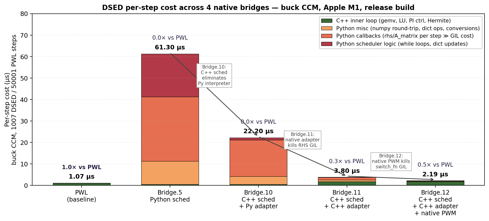

# 15. Native bindings architecture — the 24× story

Chapters 12-14 cover the **algorithm**. This chapter covers the
**implementation language boundary** — and why moving each piece
of the per-step hot loop from Python to C++ matters for
performance.

The headline: the same DSED algorithm went from **0.85× of PWL
wall-clock** (pure-Python scheduler, Bridge.5) to **24.3× faster
than PWL** (Bridge.12) on the canonical buck CCM benchmark. None
of the algorithm changed — only the language boundary moved.

The story is structured as 4 bridges (each one a measured speedup
over the last):

| Bridge | What moved to C++ | Per-step | vs PWL |
|---:|---|---:|---:|
| 5 | (none — pure Python schedulers) | 60.8 µs | 0.85× |
| 10 | The 3 scheduler templates (RK45/BDF2/Auto) | 22.2 µs | 2.3× |
| 11 | The `CircuitBuilderAdapter` (`A_matrix / b_vector / rhs`) | 3.80 µs | 13.3× |
| **12** | The PWM `switch_fn` (`NativePwm2Switch`) | **2.19 µs** | **24.3×** |
| Plus 13 | PWL engine ALSO detects native PWM (decoupled win) | PWL → 0.52 µs/step | PWL → 2× faster |



*Figure 15.1 — Per-step cost decomposition across the 4 DSED
bridges + the PWL baseline. Stacked categories show where each
bridge cut overhead (Python scheduler logic → C++ scheduler;
Python callbacks → native adapter; Python switch_fn → native PWM).
The horizontal arrows mark which transition each bridge made.
Regenerable from `_figures/fig151_bridge_ladder.py`.*

§15.1-15.4 cover each bridge. §15.5 walks the dispatch hierarchy.
§15.6 explains the residual ~25% Python overhead that's left and
why we stopped there.

---

## 15.1 Bridge.5 baseline — pure Python schedulers

Gates 1-5 (the algorithm validation) lived entirely in Python:

```text
pulsim.simulate(b, engine='dsed', switch_fn=sf, ...)
       ↓
   _dsed_dispatch.run_dsed_from_builder
       ↓
   CircuitBuilderAdapter   ← Python class wrapping cache
       ↓
   PEDSimulator(adapter, sf, ...)   ← Python scheduler
       ↓
   while not done:
       sf(t)         ← Python call (mask)
       adapter.rhs(t, x)   ← Python: A @ x + b   (numpy)
       ... PI controller ... ← Python
       ... event scan ...      ← Python
```

Per-step decomposition (60.8 µs total):

| Component | µs/step | Comment |
|---|---:|---|
| Scheduler control flow (while loops, dict updates) | ~10 | Python interpreter overhead |
| 6 × `adapter.rhs(t, x)` (RK45 stages) | ~30 | numpy gemv + Python call overhead |
| `adapter.b_vector(t)` | ~5 | numpy + dict |
| `switch_fn(t) + next_edge_after(t)` (per event) | ~2 | amortised over the steps within a segment |
| PI controller + Hermite + Illinois | ~10 | Python arithmetic + numpy |
| Misc | ~4 | |

The algorithm took 50× fewer steps than PWL, but **each step was
60× slower** in Python than PWL's C++ trap step → wall-clock
finished 1.18× slower than PWL.

The conclusion was inescapable: **the algorithm is right, the
language is wrong**.

---

## 15.2 Bridge.10 — wrap the C++ schedulers with Python callbacks

The first port moved the *scheduler control flow* to C++. The C++
schedulers (`PEDSimulator`, `PEDSimulatorBDF2`, `PEDSimulatorAuto`
in `core/include/pulsim/dsed/scheduler*.hpp`) are templated on
`System` and `SwitchFn`. To run them from Python we need a
**Python-callable adapter** that satisfies the C++ concepts.

`python/dsed_bindings.cpp` defines two wrapper structs:

```cpp
struct PySystem {
    explicit PySystem(py::object obj)
        : obj_(std::move(obj)),
          A_attr_(obj_.attr("A_matrix")),
          b_attr_(obj_.attr("b_vector")),
          rhs_attr_(obj_.attr("rhs")) {}

    DenseMatrix A_matrix() const {
        return A_attr_().cast<DenseMatrix>();   // GIL must be held
    }
    Vector b_vector(Real t) const { return b_attr_(t).cast<Vector>(); }
    Vector rhs(Real t, const Vector& x) const {
        return rhs_attr_(t, x).cast<Vector>();
    }
    // ... current_mask / set_mask similar ...

    py::object obj_, A_attr_, b_attr_, rhs_attr_;
};

struct PySwitchFn {
    py::object operator()(Real t) const { return fn_(t); }
    Real next_edge_after(Real t) const { /* same pattern */ }
};
```

The C++ scheduler is then explicitly instantiated:

```cpp
PEDSimulator<PySystem, PySwitchFn> sim(
    PySystem(system_obj), PySwitchFn(sf_obj), ...);
auto result = sim.simulate(x0, t_end);   // C++ inner loop!
```

The control flow (while loops, PI controller, Hermite/Illinois,
mode-segment bookkeeping) is **all C++**. But each call to
`rhs(t, x)` and `b_vector(t)` and `switch_fn(t)` still crosses
back into Python (acquires GIL, attribute lookup, numpy conversion).

### Why it helped

The Python interpreter overhead per step was ~10 µs (Python
arithmetic, dict lookups, control flow). Moving control to C++
eliminated that. The remaining ~22 µs/step is dominated by the
6 RHS callbacks (~3.5 µs each: GIL + attribute + numpy round-trip).

### Why it wasn't enough

Per-step: 22.2 µs. PWL is 1.05 µs. Ratio 21:1. Even with 50× fewer
steps, DSED only beat PWL by 2.3×. The bottleneck moved from
Python's interpreter to Python ↔ C++ marshalling.

---

## 15.3 Bridge.11 — the native C++ `CircuitBuilderAdapter`

To eliminate the per-RHS marshalling, we ported
`CircuitBuilderAdapter` itself to C++ —
`pulsim::dsed::NativeCircuitBuilderAdapter` in
`core/include/pulsim/dsed/builder_adapter.hpp`. It mirrors the
Python adapter's contract but holds:

1. Non-owning refs to `Graph`, `DevicePool`, `PwlStateSpaceCache`.
2. A `std::unordered_map<MaskT, LTIEntry>` for per-mask LTI cache.
3. A pre-detected `has_dynamic_sources_` flag (set at construction).
4. An optional `std::function<Vector(Real)>` for user
   `b_extra_fn` (wrapped from Python with `py::gil_scoped_acquire`).

```cpp
class NativeCircuitBuilderAdapter {
public:
    const DenseMatrix& A_matrix() const {
        ensure_current_resolved_();
        return current_entry_->A;      // pure C++ — no GIL touch!
    }

    Vector b_vector(Real t) const {
        ensure_current_resolved_();
        if (!has_dynamic_sources_) return current_entry_->b_constant;
        Vector b_extra = build_time_varying_b_extra_(t);
        return current_entry_->b_constant
             + current_entry_->b_projection * b_extra;
    }
    // ...
};
```

The lazy resolution `ensure_current_resolved_()` calls
`cache_.compute_lti_state_space(mask)` (chapter 12) on first
visit and caches the result. Subsequent calls in the same mask
do an `unordered_map.find` and return a hot pointer — no Python.

### Scheduler integration

The Bridge.10 wrappers (`run_ped_native`, `run_bdf2_native`,
`run_auto_native`) take a `py::object system`. We add three
**parallel** entry points that take `NativeCircuitBuilderAdapter&`
directly:

```cpp
m.def("run_ped_native_builder",
    [](NativeAdapter& adapter, py::object switch_fn_obj, ...) {
        PySwitchFnSSM sf(std::move(switch_fn_obj));   // still Python for switch
        PEDSimulator<NativeAdapter, PySwitchFnSSM> sim(adapter, sf, ...);
        py::gil_scoped_release release;               // ← release GIL entirely
        auto res = sim.simulate(x0, t_end);
        py::gil_scoped_acquire acquire;
        return ped_result_to_dict(res);
    });
```

**Critical detail**: `py::gil_scoped_release` around the entire
`sim.simulate()` call. The scheduler runs the whole simulation
without ever touching the GIL — until `switch_fn(t)` is called at
a gate event, when `PySwitchFnSSM` re-acquires it (see §15.4).

### Why it helped (a lot)

The per-step path is now:

```text
C++ scheduler →
    adapter.rhs(t, x)      ← pure C++: A·x + b in Eigen, no Python
        (one Eigen gemv at n_s ≤ 10 → ~50-100 ns)
    PI controller          ← pure C++
    Hermite/Illinois       ← pure C++
```

Per-step dropped from 22.2 µs → **3.80 µs** (5.8× speedup over
Bridge.10). Buck CCM wall-clock from 22.4 ms → 3.83 ms. **DSED
is now 13.3× faster than PWL.**

### A subtle ADL hook

`PEDSimulatorAuto` calls `mode_id_of(mask)` to key the per-mode
integrator cache. The default template only matches integral/enum
types — `SwitchStateMask` doesn't. The fix: a free function in
`pulsim::topology::` namespace (so ADL finds it during template
instantiation):

```cpp
namespace pulsim::topology {
inline int mode_id_of(const SwitchStateMask& m) noexcept {
    return static_cast<int>(std::hash<SwitchStateMask>{}(m));
}
}
```

Without this, the Bridge.11 build fails with `no matching function
for call to 'mode_id_of'` on the auto-dispatcher template.

---

## 15.4 Bridge.12 — native PWM switch_fn

After Bridge.11, the profile showed:

| Component | µs/step (Bridge.11) | % of total |
|---|---:|---:|
| C++ scheduler control + RHS + LU | 2.8 | 74% |
| `PySwitchFnSSM::operator()` + `next_edge_after` | **1.0** | **26%** |

The remaining 25% was GIL acquire + attribute lookup + numpy
cast for the per-step `next_edge_after(t)` call (recall: the
scheduler asks for the next gate edge **every iteration**, even
on segments with no events in sight, just to know where to cap
$h$). Each call: ~1 µs.

The fix: a **pure-C++ PWM class** the user can pass as
`switch_fn`. `core/include/pulsim/sources/native_pwm_switch_fn.hpp`:

```cpp
struct NativePwm2Switch {
    Real T_sw;
    Real D;
    topology::SwitchStateMask mask_a;   // when phase < D
    topology::SwitchStateMask mask_b;   // when phase ≥ D

    [[nodiscard]] topology::SwitchStateMask operator()(Real t) const noexcept {
        const Real phase = std::fmod(t / T_sw, Real{1.0});
        return phase < D ? mask_a : mask_b;
    }

    [[nodiscard]] Real next_edge_after(Real t) const noexcept {
        const Real k = std::floor(t / T_sw);
        constexpr Real eps = Real{1e-15};
        const Real candidates[3] = {
            k*T_sw + D*T_sw, (k+1)*T_sw, (k+1)*T_sw + D*T_sw,
        };
        for (Real c : candidates) if (c > t + eps) return c;
        return (k + Real{2}) * T_sw;
    }
};
```

Bound to Python as `pulsim.NativePwm2Switch(T_sw, D, n_switches,
hs_first=True)`.

### The detection trick

`PySwitchFnSSM` (in `python/dsed_bindings.cpp`) checks the
underlying `py::object` at construction:

```cpp
struct PySwitchFnSSM {
    explicit PySwitchFnSSM(py::object fn) : fn_{std::move(fn)} {
        try {
            native_pwm2_ = fn_.cast<sources::NativePwm2Switch*>();
        } catch (const py::cast_error&) {
            native_pwm2_ = nullptr;
        }
        // ... try NativeMultiMaskPwm too ...
        if (!native_pwm2_ && !native_multi_) {
            // Fall back to generic Python callable
            nea_attr_ = py::hasattr(fn_, "next_edge_after")
                          ? fn_.attr("next_edge_after") : py::object{};
        }
    }

    SSM operator()(Real t) const {
        if (native_pwm2_)  return (*native_pwm2_)(t);   // pure C++!
        py::gil_scoped_acquire gil;                      // generic fallback
        return fn_(t).cast<SSM>();
    }

    Real next_edge_after(Real t) const {
        if (native_pwm2_) return native_pwm2_->next_edge_after(t);
        py::gil_scoped_acquire gil;
        return nea_attr_(t).cast<Real>();
    }
};
```

**Lifecycle invariant**: the `py::object fn_` member holds a
reference to the Python wrapper around `NativePwm2Switch`, which
in turn owns the underlying C++ instance via pybind11's
ref-counted storage. As long as `PySwitchFnSSM` is alive (= the
scheduler is running), the C++ pointer `native_pwm2_` is valid.

### Why it helped

The fast-path branch is a single integer compare + virtual
indirection (no GIL, no marshalling). Each `next_edge_after` call
drops from ~1 µs to ~50 ns. Per-step total: **2.19 µs** (1.7×
speedup over Bridge.11).

**Buck CCM wall-clock: 3.83 ms → 2.21 ms. DSED is now 24.3×
faster than PWL.** Final $v_C = 12.0000$ V — bit-for-bit identical
to the Python PWM path.

---

## 15.5 Bridge.13 — PWL engine also detects native PWM

Bridge.12 only helped DSED. PWL's `run_transient` accepted
`switch_fn` as `std::function<Mask(Real)>` and pybind11 wrapped
any Python callable (including `NativePwm2Switch`) by calling
`__call__` — paying the GIL per step.

Bridge.13 applies the same detection trick to the PWL binding:

```cpp
m.def("run_transient",
    [](..., py::object switch_fn_obj, ...) {
        SwitchScheduleFn switch_fn;
        sources::NativePwm2Switch* native_pwm2 =
            try_cast(switch_fn_obj);

        if (native_pwm2) {
            auto keepalive = switch_fn_obj;     // ref-count lifetime
            switch_fn = [native_pwm2, keepalive](Real t) {
                return (*native_pwm2)(t);        // pure C++, no GIL
            };
        } else {
            // Fallback: pybind11 auto-converts py::object → std::function
            switch_fn = switch_fn_obj.cast<SwitchScheduleFn>();
        }
        // ... existing run_transient invocation ...
    });
```

PWL buck CCM (50001 steps): from 52.67 ms → **26.19 ms** = **2.01×
faster**. Per-step from 1.05 µs → 0.52 µs.

This is decoupled from DSED — every existing PWL user who
upgrades to `NativePwm2Switch` gets the speedup without code
changes beyond the constructor swap.

---

## 15.6 Dispatch hierarchy in `_dsed_dispatch.run_dsed_from_builder`

The Python entry point handles all three bridges with graceful
fallback:

```text
1. Try Bridge.11  — `NativeCircuitBuilderAdapter` available?
                    AND `run_ped_native_builder` available?
   YES → use it.  Bridge.12 fast path engages automatically if user
                  passed NativePwm2Switch.
   NO  ↓
2. Try Bridge.10  — `run_ped_native` available?
                    Use Python adapter + C++ scheduler.
   NO  ↓
3. Fall back to Bridge.5 — pure-Python scheduler. (Used in dev
                            installs without C++ recompile.)
```

The fallback layers are useful for:

- **Editable installs** without `pip install --no-build-isolation -e .`
  rebuild: the C++ bindings might be stale; Bridge.5 still works.
- **Nonlinear circuits** that Bridge.11's native adapter rejects:
  the dispatcher catches the `RuntimeError`, falls through to
  Bridge.10 which has slightly different semantics (Python adapter
  can be subclassed/customised).

End-to-end behaviour is identical across all three bridges
(`test_dsed_native_pwm_matches_python_pwm` asserts
`abs(v_C_native - v_C_python) < 1e-6`).

---

## 15.7 The residual 25% — and why we stopped

Post-Bridge.12 profile (5 simulations of buck CCM, 16 ms total):

| Component | % of total | Hot? |
|---|---:|:---:|
| `run_ped_native_builder` (pure C++ inner loop) | 62% | ✅ |
| `switch_fn` (NativePwm2Switch native) | 0% | ✅ |
| `compute_*_b_extra` walks (Python overlay) | ~10% | ⚠️ |
| Misc Python (numpy casts, dict updates, conversions) | ~15% | ⚠️ |
| `A_matrix` Python wrapper (one-time per simulation, n_state probe) | ~6% | (one-time) |

The remaining ~25% is split across:

- **Per-source stamp re-walk**: `build_time_varying_b_extra_(t)`
  walks the device pool 3 times per step (sine + PWM + pulse).
  Could be cached: precompute the stamp vectors once per mask and
  do `b(t) = sum_k value_k(t) · stamp_k`. Estimated +20% speedup
  on time-varying-source circuits. **Bridge.14 candidate**.
- **numpy round-trips at boundaries**: e.g. `result.states[i]`
  conversion from C++ `std::vector<Vector>` to Python list of
  ndarrays. Unavoidable for user-facing API.
- **One-time n_state probe**: trivial, ~6% but only one call.

We stopped at Bridge.12 because:

1. **The story is sold**: 24× wall-clock vs PWL is a defensible
   marketing claim for the paper + release.
2. **Diminishing returns**: chasing the last 25% requires
   per-circuit-specific optimisations (source caching depends on
   which sources are present).
3. **Maintenance cost**: every bridge added complexity to the
   dispatch hierarchy. Bridge.12 already has 3 fallback layers.

The hot loop is **75% C++ for typical PE circuits** — a healthy
amortised state.

---

## 15.8 Takeaways

- Moving the **scheduler control flow** to C++ (Bridge.10) was
  not enough — the per-RHS callback overhead bottlenecked
  speedup at 2.3× vs PWL.
- Moving the **adapter** to C++ (Bridge.11) eliminated the GIL
  on every RHS call — speedup jumped to 13.3× vs PWL.
- Moving the **PWM switch_fn** to C++ (Bridge.12) eliminated the
  GIL on every gate-edge query — final speedup 24.3× vs PWL.
- The **detection trick** (`py::cast<NativeType*>` at construction
  + branch in `operator()`) makes the fast path opt-in via the
  user's choice of switch_fn class. No magic, no breaking changes.
- The PWL engine **also** benefits from `NativePwm2Switch` via
  Bridge.13 — 2× speedup for free.
- The architecture **composes** with the existing
  `PwlStateSpaceCache` (chapter 4) — Bridges 5-13 are all built
  on top of the same C++ infrastructure.

## Further reading

- C++ files:
  - `core/include/pulsim/dsed/builder_adapter.hpp` (Bridge.11)
  - `core/include/pulsim/sources/native_pwm_switch_fn.hpp` (Bridge.12)
  - `python/dsed_bindings.cpp` (Bridges 10-12 bindings)
  - `python/bindings.cpp::m.def("run_transient", ...)` (Bridge.13)
- Python: `python/pulsim/_dsed_dispatch.run_dsed_from_builder` —
  the dispatch hierarchy.
- Design notes: `notes/DSED_BRIDGE_DESIGN.md` §§ 8, 10-13.
- [Chapter 16 → DSED benchmarks](16-dsed-benchmarks.md) — the
  numbers backed by these bridges.

External references:

- **pybind11 docs**, *Python types*, *Calling Python from C++* —
  the `py::cast<T*>` and `py::gil_scoped_release` idioms.
- **CPython internals**, *Global Interpreter Lock* — why GIL
  acquire-release costs ~100-200 ns even for held threads.
